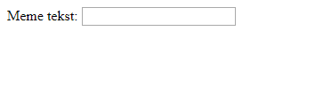

## De afbeelding en tekst ophalen

We willen dat mensen hun eigen foto en tekst kunnen gebruiken om de meme te maken, dus we hebben een manier nodig waarop ze deze kunnen gebruiken. Laten we een formulier toevoegen dat onze gebruiker kan invullen.

Als je een bestand op jouw computer gebruikt, zet je deze code tussen `<body>` en `</body>`. Als je CodePen gebruikt, plaats deze code dan in de HTML-sectie.

- Voeg de tags `<form>,` die het begin van het formulier aangeeft, en `</form>,` die het einde van het formulier aangeeft, toe.

    ```html
    <form>
    </form>
    ```

- Voeg binnen je `<form>` een tekstvak toe zodat je de tekst voor de meme kunt typen:

  ```html
  <form>
  Meme-tekst: <input type="text" id="user_text" maxlength="70"><p>
  </form>
  ```

- Sla je code op en vernieuw je browser om het door jou gemaakte vak te zien.

    

- Voeg code op de regel onder je eerste vak toe om een nieuw invoervak te maken. Deze keer zal het invoervak geen tekstvak zijn, maar een speciaal vak om het afbeeldingsbestand voor de meme te selecteren. Het invoertype moet `file` zijn en de naam van de invoer moet `user_picture` zijn.

--- hints ---

--- hint --- Dit is wat de code die je al schreef doet:

  * `input` zegt dat we een manier creëren voor de gebruiker om wat gegevens te verstrekken
  * `type="text"` zegt dat de gegevens tekst zullen zijn
  * `id="user_text"` geeft dit specifieke vak een naam of ID, een beetje zoals een variabelenaam
  * `maxlength="70"` is optioneel - het voorkomt dat je meer dan 70 letters typt, zodat jouw tekst geen ruimte inneemt onder de onderkant van de afbeelding
  * De tag `<p>` na het invoervak voegt een alinea toe (een beetje ruimte voor het volgende invoervak)

Kun je uitzoeken hoe je met deze informatie een ander invoervak kunt maken?

--- /hint ---

--- hint ---

Je moet de delen van de code die gemarkeerd zijn met `***` hieronder wijzigen:

```html
Kies een afbeelding <input type="***" id="***"><p>
```

--- /hint ---

--- hint --- Hier is de code die je moet toevoegen:

```html
Kies een afbeelding <input type="file" id="user_picture"><p>
```
--- /hint ---

--- /hints ---

- Je kunt deze vakken gebruiken om iets in te typen en een bestand te selecteren, maar er gebeurt nog niets. **Opmerking**: alle afbeeldingen worden op jouw computer bewaard - dit programma zal niets naar het internet uploaden.
