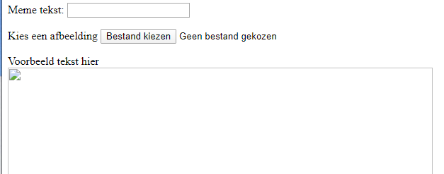
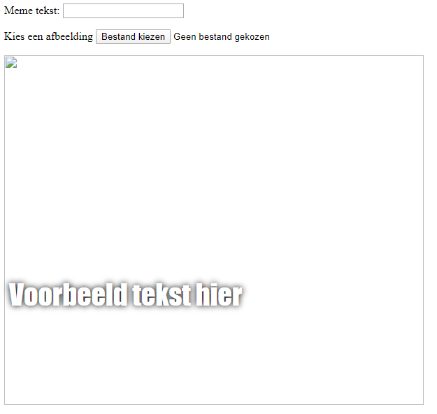

## Bouw de meme

We moeten een gebied creëren waar de meme wordt weergegeven. Dit gebied zal leeg beginnen, want wanneer de pagina voor het eerst wordt geladen, weten we niet welke afbeelding of welke tekst de persoon wil gebruiken.

- Voeg een nieuwe regel code toe onder de `</form>` tag:

  ```html
  <div id="meme_text">Voorbeeldtekst hier</div>
  ```

  Dit is een `<div>`-element - het is een onzichtbaar vak dat uiteindelijk de tekst voor onze meme zal bevatten. We hebben het een `id` gegeven net als bij de invoervakken.

- Voeg nu nog een `<div>` toe onder de vorige:

  ```html
    <div id="meme_picture"></div>
    ```

    Binnen deze `<div>` is er ook nog een tag die een afbeelding weergeeft. `src=""` geeft aan welke afbeelding moet worden weergegeven. In dit geval hebben we de afbeelding leeg gelaten, omdat we de afbeelding van de gebruiker nog niet hebben.

- Opslaan en verversen. De afbeelding is een leeg vak en de voorbeeldtekst wordt weergegeven in het standaardlettertype, wat niet erg meme-achtig is:

    

- Als je een bestand op je computer gebruikt, zoek dan de sectie `<head>` in je code op en voeg deze code tussen `<head>` en `</head>` toe. (Sla deze stap over als je CodePen gebruikt.)

  ```html
  <style type="text/css">
  </style>
  ```

- Plak de onderstaande code tussen de `<style>`-tags om je tekst een meme-stijl te geven. Als je CodePen gebruikt, plak het dan in de CSS-sectie.

    ```css
    #meme_text {
        background-color: transparent;
        font-size: 40px;
        font-family: "Impact";
        color: white;
        text-shadow: black 0px 0px 10px;
        width: 600px;
        position: absolute;
        left: 15px;
        top: 400px;
    }
    ```

  De `left: 15px` en `top: 400px` regels bepalen hoe ver de tekst van de linker- en bovenkant van de pagina verwijderd is. Als je wilt kun je deze getallen wijzigen om de tekst op een andere plaats in je meme te laten verschijnen. Als je meer wilt weten over CSS-stijlen, bezoek dan de [w3schools CSS-referentie](http://www.w3schools.com/CSSref/){:target="_blank"}.

  
