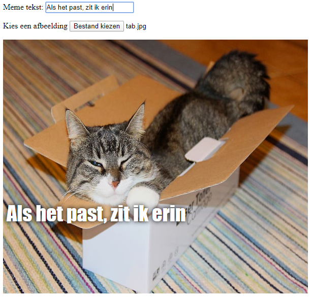

## Toon een afbeelding

We zullen nu wat code schrijven om de afbeelding te gebruiken die de gebruiker heeft geselecteerd en deze in de meme te laten zien.

- Definieer een nieuwe JavaScript-functie genaamd `update_image`. Zorg ervoor dat je deze code typt na de sluit accolade `}` van de vorige functie die je hebt gemaakt.

[[[generic-javascript-create-a-function]]]

- Binnen de `update_image` functie, maak je twee nieuwe variabelen:

    ```javascript
    var img = document.querySelector('img');
    ```

    Deze eerste variabele selecteert de eerste (en enige!) `` tag in het document, zodat we de pagina kunnen vertellen waar de geselecteerde afbeelding moet worden weergegeven.

    ```javascript
    var file = document.querySelector('input[type=file]').files[0];
    ```

    Deze tweede variabele verwijst naar het geselecteerde katten-afbeeldingsbestand.

- Stel de image tag in om de afbeelding te bevatten die de gebruiker heeft geüpload:

    ```javascript
    img.src =  window.URL.createObjectURL(file);
    ```

- Voeg nu wat code toe om de bestandsinvoer te vertellen de `update_image()` functie `onchange` aan te roepen wanneer iemand een bestand selecteert.

--- hints ---

--- hint --- Onthoud dat je in de vorige stap de functie `update_text()` hebt aangeroepen wanneer nieuwe tekst in het `user_text` invoerveld werd getypt. Met behulp van wat je toen hebt geleerd, kun je erachter komen hoe je de functie `update_image()` aanroept, wanneer de gebruiker een bestand selecteert in het `user_file` invoerveld? --- /hint ---

--- hint --- Je moet `onchange=""` toevoegen en vervang vervolgens de `***` met de functie die je wilt aanroepen:
```javascript
Kies een afbeelding <input type="file" id="user_picture" onchange="***">
```
--- /hint ---

--- hint --- Zoek de coderegel voor het invoervak Bestand kiezen en voeg `onchange="update_image()"` toe zoals hier:
```html
Kies een afbeelding <input type="file" id="user_picture" onchange="update_image()">
```

--- /hint ---

--- /hints ---

- Bewaar en vernieuw de pagina. Als jouw code werkt, zou wanneer je een afbeelding selecteert in het **Bestand kiezen** invoervak, die afbeelding in het meme-vak eronder moeten verschijnen. Ook als je iets in het tekstvak typt, moet je meme-tekst in de afbeelding verschijnen.


