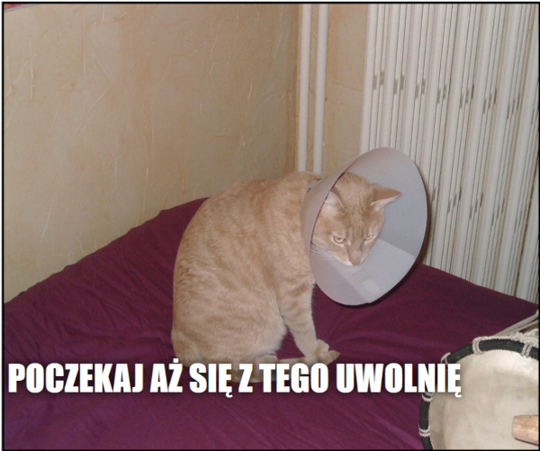

## Co stworzysz

W tym zasobie utworzysz generator kocich memów. Korzystając z obrazu twojego kota, możesz stworzyć własnego kociego mema, aby pochwalić się znajomym.

## Czego się nauczysz

Tworząc generator kocich memów nauczysz się:

- Jak pisać funkcje w JavaScript
- Jak używać JavaScript do manipulowania danymi wprowadzanymi przez użytkownika
- Jak używać `oninput` i `onchange` aby rzeczy działały na żywo na stronie internetowej w odpowiedzi na działania użytkownika

Ten projekt obejmuje elementy z następujących wątków z [Cyfrowego Programu Nauczania Raspberry Pi](https://www.raspberrypi.org/curriculum/){:target="_blank"}:

- [Projektowanie podstawowych zasobów 2D i 3D](https://www.raspberrypi.org/curriculum/design/creator){:target="_blank"}
- [Połącz konstrukcje programistyczne, aby rozwiązać problem](https://www.raspberrypi.org/curriculum/programming/builder){:target="_blank"}
