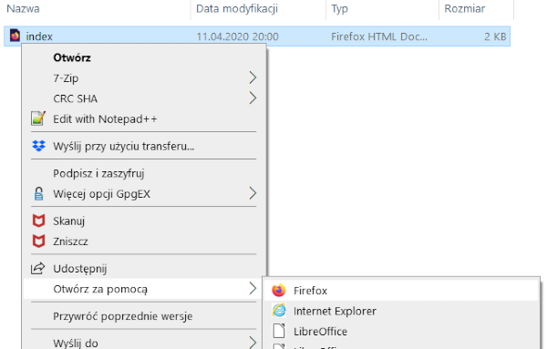

## Stwórz stronę internetową

- Otwórz pusty plik w wybranym edytorze tekstu i zapisz plik.

[[[generic-html-create-and-save]]]

- Poniższy kod HTML przedstawia podstawową strukturę strony. Skopiuj i wklej go do utworzonego pliku, a następnie zapisz plik. Zachowaj otwarty edytor tekstu, aby móc edytować plik.

  ```html
  <html>
  <head>
    <title>Moja strona</title>
  </head>
  <body>
    Moja treść tutaj
  </body>
  </html>
  ```

- Przejdź do folderu, w którym zapisałeś swoją stronę. Otwórz plik również w przeglądarce internetowej, aby mieć ten sam plik otwarty zarówno w edytorze tekstu, jak i przeglądarce.

  W systemie Windows może być konieczne kliknięcie pliku prawym przyciskiem myszy, wybranie `Otwórz za pomocą`, a następnie wybranie przeglądarki internetowej.

  

  Za każdym razem, gdy zmieniasz kod w edytorze tekstu, zapisz go, a następnie naciśnij przycisk odświeżania w przeglądarce, aby wyświetlić zaktualizowaną stronę.
