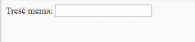

## Pozyskiwanie obrazu i tekstu

Chcemy, aby ludzie mogli używać własnego obrazu i tekstu do tworzenia memu, dlatego potrzebujemy sposobu, aby je udostępnić. Dodajmy formularz, który nasz użytkownik może wypełnić.

Jeśli używasz pliku na komputerze, ustaw ten kod między `<body>` a `</body>`. Jeśli używasz CodePen, umieść ten kod w sekcji HTML.

- Dodaj tagi `<form>`, które wskazują początek formularza, oraz `</form>`, które wskazują koniec formularza.

    ```html
    <form>
    </form>
    ```

- Wewnątrz `<form>` dodaj pole tekstowe, aby móc wpisać treść mema:

  ```html
  <form>
  Treść mema: <input type="text" id="user_text" maxlength="70"><p>
  </form>
  ```

- Zapisz kod i odśwież przeglądarkę, aby zobaczyć utworzone pole.

    

- Dodaj kod, aby utworzyć kolejne pole wprowadzania w wierszu poniżej pierwszego pola. Tym razem pole wprowadzania nie będzie polem tekstowym, ale specjalnym polem do wyboru pliku obrazu dla mema. Typem wejściowym powinien być `plik`, a nazwa wejściowa powinna wynosić `user_picture`.

--- hints ---


--- hint --- Oto, co robi już napisany kod:

  * `input` mówi, że tworzymy sposób na dostarczenie przez użytkownika pewnych danych
  * `type="text"` mówi, że dane będą tekstowe
  * `id="user_text"` nadaje temu polowi nazwę lub identyfikator, trochę jak nazwa zmiennej
  * `maxlength="70"` jest opcjonalny - powstrzymuje Cię przed wpisaniem więcej niż 70 liter, więc Twój tekst nie zajmuje miejsca poniżej dołu obrazu
  * Znacznik `<p>` po polu wprowadzania dodaje paragraf (trochę miejsca przed następnym polem wejściowym)

Czy potrafisz wymyślić, jak utworzyć kolejne pole wprowadzania przy użyciu tych informacji?

--- /hint ---

--- hint ---

Musisz zmienić części kodu wyróżnione `***` poniżej:

```html
Wybierz zdjęcie <input type="***" id="***"><p>
```

--- /hint ---

--- hint --- Oto kod, który musisz dodać:

```html
Wybierz zdjęcie <input type="file" id="user_picture"><p>
```
--- /hint ---

--- /hints ---

- Możesz użyć tych pól do wpisania i wybrania pliku, ale nic się jeszcze nie wydarzy. **Uwaga**: wszystkie obrazy są przechowywane na twoim komputerze - ten program nie przesyła niczego do Internetu.
