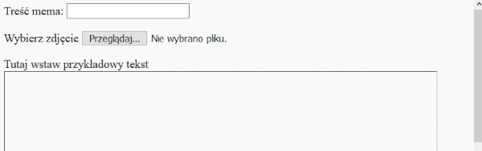
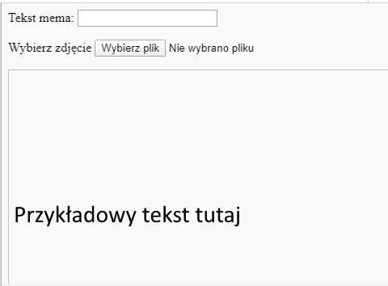

## Zbuduj mema

Musimy stworzyć obszar, w którym zostanie wyświetlony mem. Obszar ten zacznie się wyświetlać jako pusty, ponieważ gdy strona ładuje się po raz pierwszy, nie będziemy wiedzieć, jakiego obrazu lub jakiego tekstu osoba chce użyć.

- Pod znacznikiem `</form>`, dodaj nową linię kodu:

  ```html
  <div id="meme_text">Tutaj wstaw przykładowy tekst</div>
  ```

  Jest to element `<div>` - to niewidzialne pudełko, które ostatecznie pomieści tekst naszego mema. Daliśmy jej `identyfikator` tak samo jak w polach wejściowych.

- Teraz dodaj kolejny `<div>` poniżej poprzedniego:

  ```html
    <div id="meme_picture"></div>
    ```

    Wewnątrz tego `<div>`, jest również inny tag, który wyświetla obraz. `src=""` wskazuje, który obraz ma być wyświetlony. W tym przypadku zostawiliśmy obraz pusty, ponieważ nie mamy jeszcze zdjęcia od użytkownika.

- Zapisz i odśwież. Obraz będzie pustym polem i przykładowy tekst będzie wyświetlany w domyślnej czcionce, która nie jest zbyt "memiczna":

    

- Jeśli używasz pliku na komputerze, znajdź sekcję `<head>` w swoim kodzie i dodaj ten kod między `<head>` a `</head>`. (Pomiń ten krok, jeśli używasz CodePen.)

  ```html
  <style type="text/css">
  </style>
  ```

- Paste the code below between the `<style>` tags to give your text a meme style. If you're using CodePen, paste it into the CSS section.

    ```css
    #meme_text {
        background-color: transparent;
        font-size: 40px;
        font-family: "Impact";
        color: white;
        text-shadow: black 0px 0px 10px;
        width: 600px;
        position: absolute;
        left: 15px;
        top: 400px;
    }
    ```

  The `left: 15px` and `top: 400px` lines determine how far the text is from the left and the top of the page. You can alter these numbers to make the text appear in a different place on your meme if you like. If you would like to know more about CSS styles, visit the [w3schools CSS reference](http://www.w3schools.com/CSSref/){:target="_blank"}.

  
