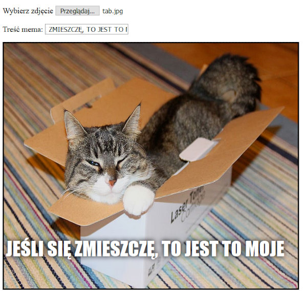

## Wyświetl obraz

Teraz napiszemy jakiś kod, aby zrobić obrazek kota, który użytkownik wybrał i wyświetli go w memie.

- Zdefiniuj nową funkcję JavaScript o nazwie `update_image`. Bądź ostrożny, aby wpisać ten kod po zamknięciu nawiasów klamrowych `}` poprzedniej funkcji, którą utworzyłeś.

[[[generic-javascript-create-a-function]]]

- Wewnątrz funkcji `update_image` utwórz dwie nowe zmienne:

    ```javascript
    var img = document.querySelector('img');
    ```

    Ta pierwsza zmienna wybiera (tylko!) pierwszy tag `` w dokumencie, abyśmy mogli poinformować stronę, gdzie wyświetlić wybrany obraz.

    ```javascript
    var file = document.querySelector('input[type=file]').files[0];
    ```

    Ta druga zmienna wskazuje na wybrany plik obrazu kota.

- Ustaw znacznik obrazu na zawierający zdjęcie, które użytkownik przesłał:

    ```javascript
    img.src =  window.URL.createObjectURL(file);
    ```

- Teraz dodaj trochę kodu, aby polecenie wejściowe pliku wywołało `update_image ()` zamiana funkcji `onchange` gdy ktoś wybierze plik.

--- hints ---


--- hint --- Pamiętaj, że w poprzednim kroku nazwałeś funkcję `update_text()` kiedy nowy tekst został zapisany w polu wprowadzania `user_text`. Wykorzystanie tego, czego się wtedy nauczyłeś, czy potrafisz wymyślić, jak wywołać funkcję `update_image()` gdy użytkownik wybierze plik w polu wejściowym `user_file`?
--- /hint ---


--- hint --- Będziesz musiał dodać `onchange=""`, a następnie zastąpić `***` funkcją, którą chcesz wywołać:
```javascript
Wybierz zdjęcie <input type="file" id="user_picture" onchange="***">
```
--- /hint ---

--- hint --- Znajdź linię kodu pola wprowadzania pliku i dodaj `onchange="update_image()"` w następujący sposób:
```html
Wybierz zdjęcie <input type="file" id="user_picture" onchange="update_image()">
```

--- /hint ---

--- /hints ---

- Zapisz i odśwież stronę. Jeśli twój kod działa po wybraniu zdjęcia używając pola wejściowego **Wybierz zdjęcie**, ten obrazek powinien pojawić się w polu mema poniżej. Jeśli wpisujesz coś w polu tekstowym, treść mema powinnna pojawić się na zdjęciu.


