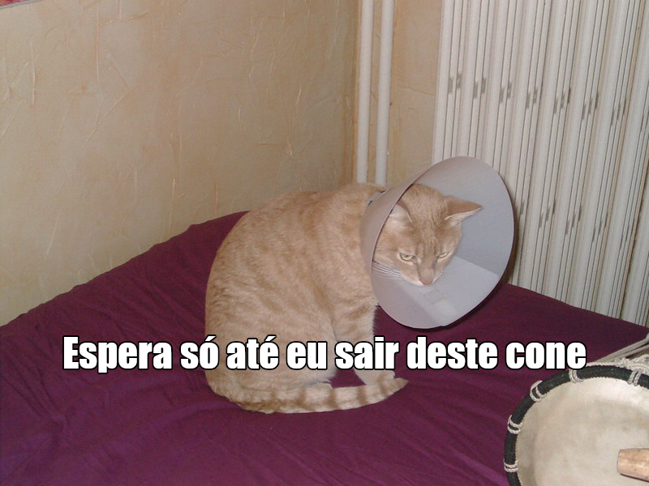

## O que você vai fazer

Neste projeto, você criará um gerador de memes para gatos. Usando uma imagem do seu gato, você pode criar seu próprio meme de gato para mostrar aos seus amigos.

## O que você vai aprender

Criando um gerador de memes para gatos, você aprenderá:

- Como escrever funções em JavaScript
- Como usar JavaScript para manipular a entrada de dados por um usuário
- Como usar `oninput` e `onchange` para que as coisas aconteçam ao vivo em uma página da web em resposta a ações do usuário

Este projeto abrange elementos das seguintes vertentes do [Currículo de Criação Digital Raspberry Pi](https://www.raspberrypi.org/curriculum/){:target="_blank"}:

- [Faça ilustrações 2D e 3D básicas](https://www.raspberrypi.org/curriculum/design/creator){:target="_blank"}
- [Combine construções de programação para resolver um problema](https://www.raspberrypi.org/curriculum/programming/builder){:target="_blank"}
