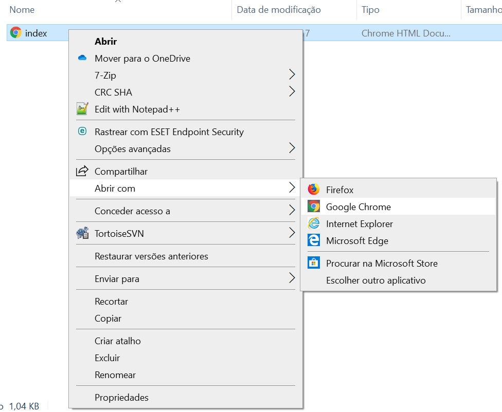

## Crie uma página da web

- Abra um arquivo em branco no editor de texto escolhido e salve o arquivo.

[[[generic-html-create-and-save]]]

- O código HTML abaixo fornece a estrutura básica de uma página. Copie e cole no arquivo que você criou e salve o arquivo. Mantenha o editor de texto aberto para poder editar o arquivo.

  ```html
  <html>
  <head>
    <title>Minha página</title>
  </head>
  <body>
    Meu conteúdo aqui
  </body>
  </html>
  ```

- Vá para a pasta onde você salvou sua página da web. Abra o arquivo também com o seu navegador da Internet, para que você tenha o mesmo arquivo aberto no editor de texto e no navegador.

  No Windows, pode ser necessário clicar com o botão direito do mouse no arquivo, escolher `Abrir com`e selecionar seu navegador da Internet.

  

  Sempre que você alterar o código no seu editor de texto, salve-o e pressione o botão de atualização no seu navegador para ver a página atualizada.
