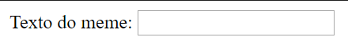

## Obtendo a foto e o texto

Queremos que as pessoas possam usar sua própria imagem e texto para criar o meme, por isso precisamos de uma maneira de fornecê-los. Vamos adicionar um formulário que nosso usuário possa preencher.

Se você estiver usando um arquivo no seu computador, coloque esse código entre `<body>` e `</body>`. Se você estiver usando o CodePen, coloque esse código na seção HTML.

- Adicione as tags `<form>` , que indica o início do formulário, e `</form>` , que indica o final do formulário.

    ```html
    <form>
    </form>
    ```

- Dentro do seu `<form>`, adicione uma caixa de texto para poder digitar o texto do meme:

  ```html
  <form>
  Meme text: <input type="text" id="user_text" maxlength="70"><p>
  </form>
  ```

- Salve seu código e atualize seu navegador para ver a caixa que você criou.

    

- Adicione código para criar outra caixa de entrada na linha abaixo da sua primeira caixa. Desta vez, a caixa de entrada não será uma caixa de texto, mas uma caixa especial para selecionar o arquivo de imagem para o meme. O tipo de entrada deve ser `arquivo` e o nome da entrada deve ser `user_picture`.

--- hints ---


--- dica --- Aqui está o que o código que você já escreveu faz:

  * `input` diz que estamos criando uma maneira de o usuário fornecer alguns dados
  * `type = "text"` diz que os dados serão de texto
  * `id = "user_text"` atribui a essa caixa específica um nome ou ID, um pouco como um nome de variável
  * `maxlength = "70"` é opcional - ele impede que você digite mais de 70 letras para que seu texto não ocupe espaço além da parte inferior da imagem
  * A tag `<p>` após a caixa de entrada adiciona um parágrafo (um pouco de espaço antes da próxima caixa de entrada)

Você pode descobrir como criar outra caixa de entrada usando essas informações?

--- /hint ---

--- hint ---

Você precisará alterar as partes do código destacadas com `***` abaixo:

```html
Selecione uma imagem <input type="***" id="***"><p>
```

--- /hint ---

--- dica --- Aqui está o código que você precisa adicionar:

```html
Selecione uma imagem <input type="file" id="user_picture"><p>
```
--- /hint ---

--- /hints ---

- Você pode usar essas caixas para digitar e selecionar um arquivo, mas nada acontecerá ainda. **Nota**: Todas as imagens são mantidas no seu computador - este programa não carrega nada da internet.
