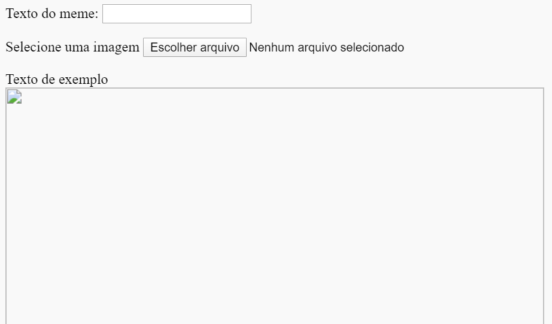

## Construa o meme

Nós precisamos criar uma área onde o meme será exibido. Essa área começará em branco porque, quando a página for carregada pela primeira vez, não saberemos qual imagem ou qual texto a pessoa deseja usar.

- Debaixo da tag ` </form>`, adicione uma nova linha de código:

  ```html
  <div id="meme_text">Exemplo de texto aqui</div>
  ```

  Este é um elemento `<div>` - É uma caixa invisível que eventualmente terá o texto do nosso meme. Demos a ele um `id`, assim como fizemos nas caixas de entrada.

- Agora adicione outro `<div>` abaixo do anterior:

  ```html
    <div id="meme_picture"></div>
    ```

    Dentro desta `<div>`, há também outra tag que exibe uma imagem. `src=""` indica qual imagem exibir. Neste caso, deixamos a imagem em branco, porque ainda não temos a imagem do usuário.

- Salve e atualize. A imagem será uma caixa em branco e o texto de exemplo será exibido na fonte padrão, que não é muito parecido com um meme:

    

- Se você estiver usando um arquivo em seu computador, encontre a seção `<head>` do seu código e adicione este código entre `<head>` e `</head>`. (Pule este passo se estiver usando o CodePen.)

  ```html
  <style type="text/css">
  </style>
  ```

- Cole o código abaixo entre as tags `<style>` para dar ao seu texto um estilo de meme. Se você estiver usando o CodePen, coloque este código na seção CSS.

    ```css
    #meme_text {
        background-color: transparent;
        font-size: 40px;
        font-family: "Impact";
        color: white;
        text-shadow: black 0px 0px 10px;
        width: 600px;
        position: absolute;
        left: 15px;
        top: 400px;
    }
    ```

  As linhas `left: 15px` e `top: 400px` determinam a que distância o texto está da esquerda e da parte superior da página. Se preferir, você pode alterar estes números para fazer o texto aparecer em um lugar diferente do seu meme. Se você quiser saber mais sobre estilos CSS, visite [w3schools CSS reference](http://www.w3schools.com/CSSref/){:target="_blank"}.

  
