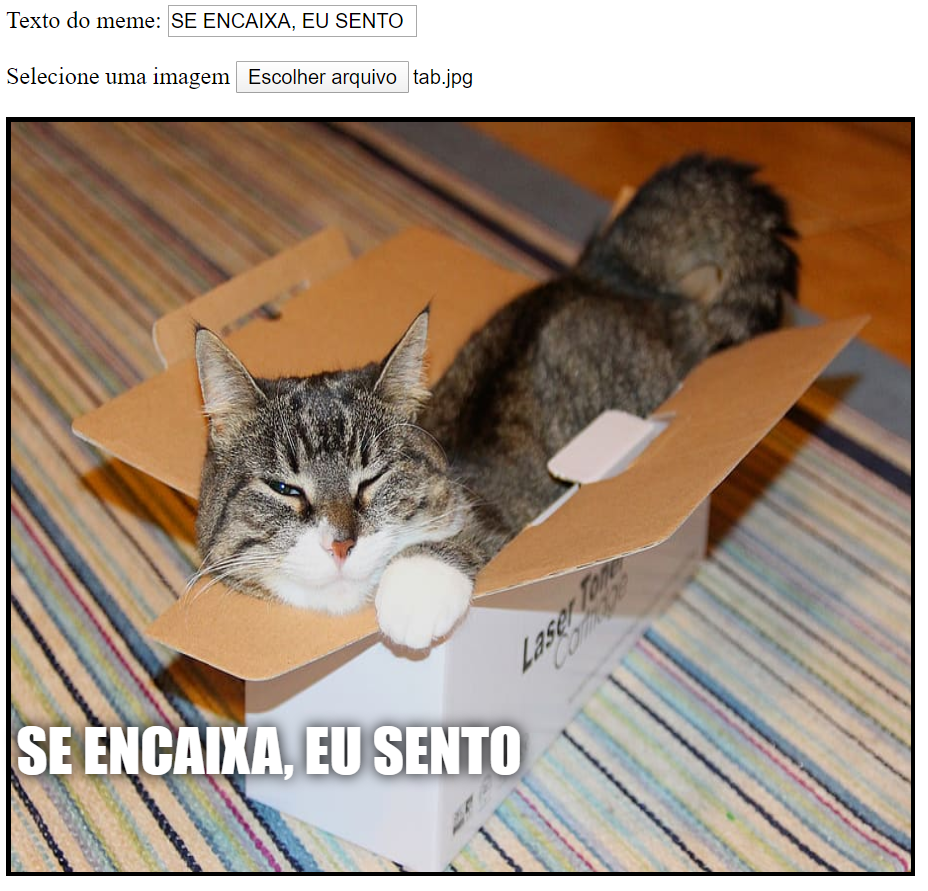

## Exibir a imagem

Agora vamos escrever o código para usar a imagem de gato que o usuário selecionou e exibi-la no meme.

- Defina uma nova função JavaScript chamada `update_image`. Tenha cuidado ao digitar este código após a chave de fechamento `}` da função que você criou anteriormente.

[[[generic-javascript-create-a-function]]]

- Dentro da função `update_image`, crie duas novas variáveis:

    ```javascript
    var img = document.querySelector('img');
    ```

    Esta primeira variável seleciona a primeira (e única!) tag `` no documento, para que possamos dizer à página onde exibir a imagem selecionada.

    ```javascript
    var file = document.querySelector('input[type=file]').files[0];
    ```

    Esta segunda variável aponta para o arquivo de imagem de gato selecionado.

- Defina a tag da imagem para conter a imagem que o usuário enviou:

    ```javascript
    img.src =  window.URL.createObjectURL(file);
    ```

- Agora adicione o código para informar a entrada do arquivo para chamar a função `update_image()` `onchange` quando alguém selecionar um arquivo.

--- hints ---


--- hint --- Lembre-se de que, na etapa anterior, você chamou a função `update_text()` quando um novo texto foi gravado na caixa de entrada `user_text`. Usando o que aprendeu, você pode descobrir como chamar a função `update_image()` quando o usuário selecionar um arquivo na caixa de entrada `user_file`?
--- /hint ---


--- hint --- Você precisará adicionar `onchange=""` e depois substituir o `***` com a função que você gostaria de chamar:
```javascript
Selecione uma imagem <input type="file" id="user_picture" onchange="***">
```
--- /hint ---

--- hint--- Encontre a linha de código para a caixa de entrada e adicione `onchange="update_image()"` desta maneira:
```html
Select a picture <input type="file" id="user_picture" onchange="update_image()">
```

--- /hint ---

--- /hints ---

- Salve e atualize a página. Se o seu código estiver funcionando, quando você selecionar uma imagem usando o botão **Selecionar uma imagem**, essa imagem deve aparecer na caixa de meme abaixo. Se você também digitar algo na caixa de texto, o texto do seu meme aparecerá na parte superior da imagem.


