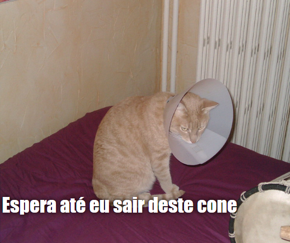

## O que vais fazer

Neste recurso, vais criar um gerador de memes de gatos. Usando uma imagem do teu gato, podes criar teu próprio meme de gato para mostrar aos seus amigos.

## O que vais aprender

Criando um gerador de memes de gatos, vais aprender:

- Como escrever funções em JavaScript
- Como usar JavaScript para manipular a entrada de dados por um utilizador
- Como usar `entrada` e `troca` para que as coisas aconteçam ao vivo em uma página da web em resposta a ações do utilizador

Este projeto abrange elementos das seguintes vertentes do [Currículo Raspberry Pi Digital Making](https://www.raspberrypi.org/curriculum/){:target = "_ blank"}:

- [Desenhar recursos básicos em 2D e 3D ](https://www.raspberrypi.org/curriculum/design/creator){:target="_blank"}
- [Combinar construções de programação para resolver um problema](https://www.raspberrypi.org/curriculum/programming/builder){: target = "_ blank"}
