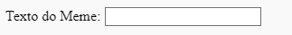

## Obtendo a foto e o texto

Queremos que as pessoas possam usar a sua própria imagem e texto para criar o meme, por isso precisamos de uma maneira de tornar isso possível. Vamos adicionar um formulário que o nosso utilizador possa preencher.

Se estiveres a usar um ficheiro no teu computador, coloque esse código entre `<body>` e `</body>`. Se estiveres a usar o CodePen, coloca este código na secção HTML.

- Adicione as tags `<form>,`, que indica o início do formulário, e `</form>,`, que indica o final do formulário.

    ```html
    <form>
    </form>
    ```

- Dentro do teu `<form>`, adicione uma caixa de texto para poder digitar o texto do meme:

  ```html
  <form>
 Texto do Meme: <input type="text" id="user_text" maxlength="70"><p>
  </form>
  ```

- Guarda o teu código e atualiza o teu navegador para ver a caixa que criaste.

    

- Adiciona código para criar outra caixa de entrada na linha abaixo da tua primeira caixa. Desta vez, a caixa de entrada não será uma caixa de texto, mas uma caixa especial para selecionar o ficheiro de imagem para o meme. O tipo de entrada deve ser `ficheiro`e o nome da entrada deve ser `user_picture`.

--- Dicas ---

--- dica --- Aqui está o que o código que já escreveste faz:

  * `entrada` diz que estamos a criar uma maneira de o utilizador fornecer alguns dados
  * `type = "text"` diz que os dados serão texto
  * `id = "user_text"` atribui a essa caixa específica um nome ou ID, um pouco como um nome de variável
  * `maxlength = "70"` é opcional - ele impede que você digite mais de 70 letras para que teu texto não ocupe espaço além da parte inferior da imagem
  * A tag `<p>` após a caixa de entrada adiciona um parágrafo (um pouco de espaço antes da próxima caixa de entrada)

Podes descobrir como criar outra caixa de entrada usando essas informações?

--- /dica ---

--- dica---

Vais precisar de alterar as partes do código destacadas com `***` abaixo:

```html
Seleciona uma imagem <input type="***" id="***"><p>
```

--- /dica ---

--- dica --- Aqui está o código que vais precisar de adicionar:

```html
Seleciona uma imagem <input type="file" id="user_picture"><p>
```
--- /dica ---

--- /dica ---

- Podes usar essas caixas para digitar e selecionar um ficheiro, mas nada acontecerá ainda. **Nota**: todas as imagens são mantidas no teu computador - este programa não carrega nada na internet.
