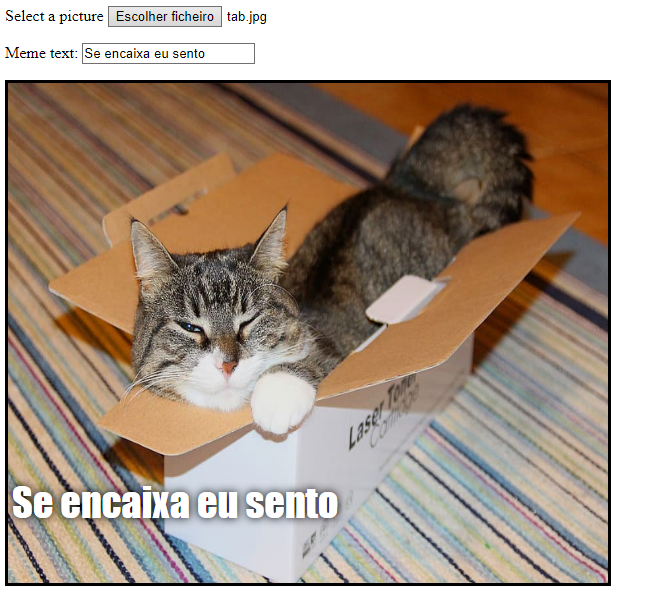

## Exibir a imagem

Agora vamos escrever algum código para usar a imagem de gato que o utilizador selecionou e exibi-la no meme.

- Define uma nova função JavaScript chamada ` update_image `. Tem cuidado ao digitar este código após a chave de fechamento `}` da função anterior que você criou.

[[[generic-javascript-create-a-function]]]

- Dentro da ` update_image `, crie duas novas variáveis:

    ```javascript
    var img = document.querySelector ('img');
    ```

    Esta primeira variável seleciona a primeira (e única!) ``tag no documento, para que possamos dizer à página onde exibir a imagem selecionada.

    ```javascript
    var file = document.querySelector ('input [type = file]'). files[0];
    ```

    Essa segunda variável aponta para o ficheiro de imagem de gato selecionado.

- Defina a tag da imagem para conter a imagem que o utilizador enviou:

    ```javascript
    img.src =  window.URL.createObjectURL(file);
    ```

- Agora adiciona algum código para informar a entrada do ficheiro para chamar a função `update_image()` `onchange` quando alguém seleciona um ficheiro.

--- dicas ---

--- dica --- Lembra-te de que, na etapa anterior, chamaste a função ` update_text () ` quando um novo texto foi gravado na caixa de entrada ` user_text `. Usando o que aprendeste, podes descobrir como chamar a função `update_image()` quando o utilizador seleciona um ficheiro na caixa de entrada `user_file`? --- /dica ---

--- dica --- Vais precisar de adicionar ` onchange = "" ` e depois substitui o ` *** ` com a função que gostarias de chamar:
```javascript
Selecione uma imagem <input type="file" id="user_picture" onchange="***">
```
--- /dica---

--- dica --- Encontre a linha de código da caixa de entrada do ficheiro e adiciona `onchange = "update_image ()"` assim:
```html
Selecione uma imagem <input type="file" id="user_picture" onchange="update_image()">
```

--- /dica ---

--- /dicas ---

- Guardar e atualizar a página. Se o teu código estiver a funcionar, quando selecionares uma imagem usando o botão ** Selecionar uma imagem. ** Na caixa de entrada, essa imagem deve aparecer na caixa de meme abaixo. Se digitares algo na caixa de texto, o texto do seu meme aparecerá na parte superior da imagem.


