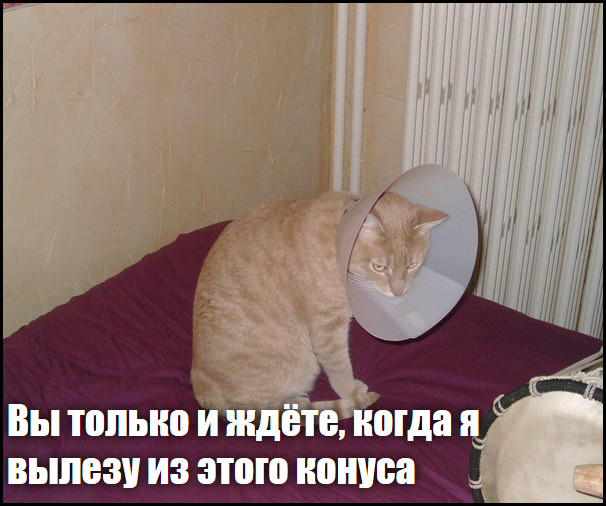

## Что ты сделаешь

На этом занятии ты сделаешь генератор кошачьего мема. Используя изображение своей кошки, ты можешь создать свой собственный кошачий мем, чтобы похвастаться перед друзьями.

## Чему ты научишься

Создав генератор кошачьего мема, ты узнаешь:

- Как писать функции в JavaScript
- Как использовать JavaScript для управления вводом данных пользователя
- Как использовать `oninput` и `onchange`, чтобы всё отражалось на веб-странице в ответ на действия пользователя

Этот урок охватывает элементы из следующих направлений учебной программы [Raspberry Pi Digital Making](https://www.raspberrypi.org/curriculum/){:target="_blank"}:

- [Основы дизайна 2D и 3D элементов](https://www.raspberrypi.org/curriculum/design/creator){:target="_blank"}
- [Объединение программных компонетов для решения задачи](https://www.raspberrypi.org/curriculum/programming/builder){:target="_blank"}
