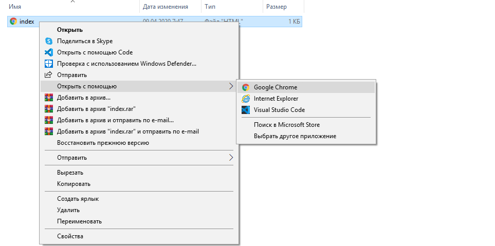

## Создание веб-страницы

- Открой пустой файл в выбранном тобою текстовом редакторе и сохрани его.

[[[generic-html-create-and-save]]]

- HTML-код ниже дает тебе основную структуру страницы. Скопируй и вставь его в созданный тобою файл, затем сохрани его. Держи текстовый редактор открытым, чтобы ты мог редактировать файл.

  ```html
  <html>
  <head>
    <title>Моя страница</title>
  </head>
  <body>
    Мой контент здесь
  </body>
  </html>
  ```

- Перейди в папку, где ты сохранил свою веб-страницу. Открой файл также с помощью интернет-браузера, чтобы у тебя был один и тот же файл, открытый как в текстовом редакторе, так и в браузере.

  В Windows тебе может потребоваться щелкнуть правой кнопкой мыши на файл, выбрать `Открыть с`, а затем выбрать свой интернет-браузер.

  

  Всякий раз, когда ты изменяешь код в текстовом редакторе, сохраняй его, а затем нажимай кнопку обновить в браузере, чтобы увидеть обновленную страницу.
