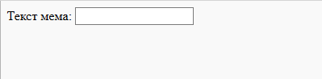

## Получение изображения и текста

Мы хотим, чтобы люди могли использовать свою собственную картинку и текст для создания мема, поэтому нам нужен способ реализовать это. Давай добавим форму, которую может заполнить наш пользователь.

Если ты используешь файл на своем компьютере, помести этот код между `<body>` и `</body>`. Если ты используешь CodePen, помести этот код в раздел HTML.

- Добавь теги `<form>`, обозначающие начало формы, и `</form>`, обозначающие конец формы.

    ```html
    <form>
    </form>
    ```

- Внутри твоего `<form>` добавь текстовое поле, чтобы ты мог ввести текст мема:

  ```html
  <form>
  Текст мема: <input type="text" id="user_text" maxlength="70"><p>
  </form>
  ```

- Сохрани код и обнови браузер, чтобы увидеть созданную тобою форму.

    

- Добавь код для создания другого поля ввода в строке ниже своего первого поля. На этот раз поле ввода будет не текстовым, а специальным полем для выбора файла изображения для мема. Типом элемента формы input должен быть `file`, а именем элемента формы input должно быть `user_picture`.

--- hints ---


--- hint --- Вот то, что делает код, который ты уже написал:

  * `input` говорит о том, что мы создаем способ предоставить пользователю некоторые данные
  * `type="text"` говорит о том, что данные будут текстовыми
  * `id="user_text"` даёт этому конкретному блоку имя или идентификатор, немного похожий на имя переменной
  * `maxlength="70"` не обязателен – он не позволяет вводить текст более 70 букв, чтобы он не занимал место за нижней частью изображения
  * Тег после поля ввода добавляет абзац (немного места перед следующим полем ввода)

Можешь ли ты решить, как создать ещё одно поле ввода, используя эту информацию?

--- /hint ---

--- hint ---

Тебе нужно будет изменить места кода, выделенные `***`, как показано ниже:

```html
Выбери изображение <input type="***" id="***"><p>
```

--- /hint ---

--- hint --- Вот код, который нужно добавить:

```html
Выбери изображение <input type="file" id="user_picture"><p>
```
--- /hint ---

--- /hints ---

- Ты можешь использовать эти поля для ввода и выбора файла, но пока ничего не произойдет. **Примечание**: все изображения хранятся на вашем компьютере – эта программа ничего не загружает в интернет.
