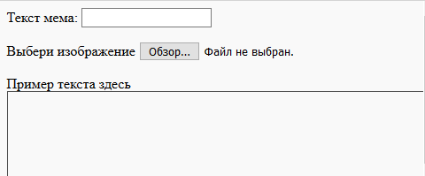
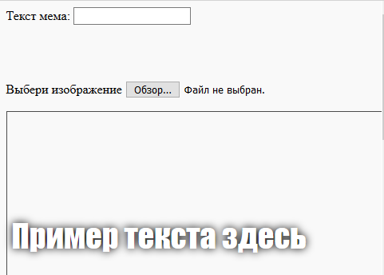

## Построй мем

Нам нужно создать область, где будет отображаться мем. Эта область будет пустой, потому что при первой загрузке страницы мы не будем знать, какое изображение или какой текст хочет использовать человек.

- Под тегом `</form>`, добавьте новую строку кода:

  ```html
  <div id="meme_text">Здесь пример текста</div>
  ```

  Это элемент `<div>` – это невидимое поле, которое в конечном итоге будет содержать текст для нашего мема. Мы дали ему `id` так же, как мы сделали для полей ввода.

- Теперь добавь еще один `<div>` ниже предыдущего:

  ```html
    <div id="meme_picture"></div>
    ```

    Внутри этого `<div>`, также есть другой тег, который отображает изображение. `src=""` указывает какое изображение показать. В данном случае мы оставили изображение пустым, потому, что у нас пока нет изображения от пользователя.

- Сохрани и обнови. Изображение будет пустым, а текст примера будет отображаться шрифтом по умолчанию, который не очень похож на мем:

    

- Если ты работаешь с файлом на компьютере, найди секцию `<head>` в своем коде и добавь этот код между `<head>` и `</head>`. (Пропусти этот шаг, если ты используешь CodePen.)

  ```html
  <style type="text/css">
  </style>
  ```

- Вставь код, указанный ниже, между тегами `<style>`, чтобы придать своему тексту стиль мема. Если ты используешь CodePen, помести этот код в раздел HTML.

    ```css
    #meme_text {
        background-color: transparent;
        font-size: 40px;
        font-family: "Impact";
        color: white;
        text-shadow: black 0px 0px 10px;
        width: 600px;
        position: absolute;
        left: 15px;
        top: 400px;
    }
    ```

  Строки `left: 15px` и `top: 400px` определяют, насколько далеко находится текст слева и вверху страницы. Ты можешь изменить эти цифры, чтобы текст отображался в другом месте в твоём меме, если хочешь. Если ты хочешь узнать больше о стилях CSS, посети [ссылку w3schools CSS](http://www.w3schools.com/CSSref/){:target="_blank"}.

  
