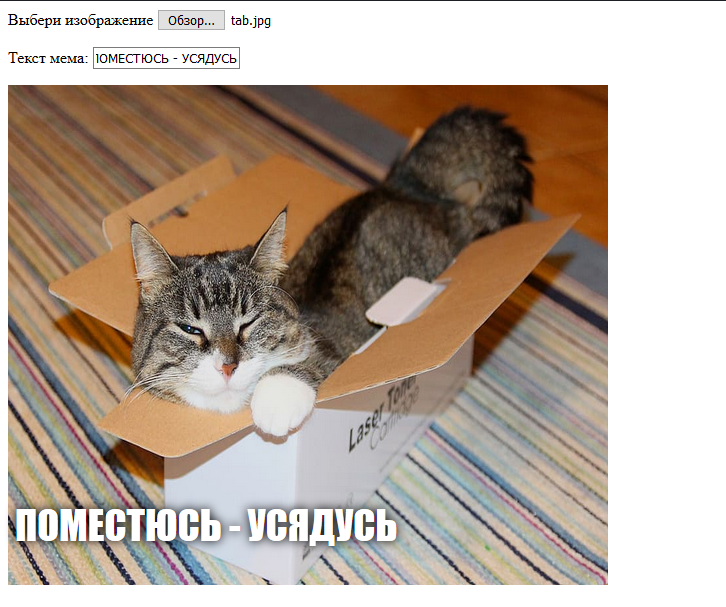

## Показ изображения

Теперь мы напишем некоторый код для того, чтобы взять изображение кошки, которое выбрал пользователь, и отобразить его на меме.

- Создай новую функцию в JavaScript с именем `update_image`. Будь осторожен при вводе этого кода после закрывающей фигурной скобки `}` предыдущей функции, которую ты создал.

[[[generic-javascript-create-a-function]]]

- Внутри функции `update_image` создай две новые переменные:

    ```javascript
    var img = document.querySelector('img');
    ```

    Эта первая переменная выбирает первый (и единственный!) в файле тег ``, чтобы мы могли указать странице, где отображать выбранное изображение.

    ```javascript
    var file = document.querySelector('input[type=file]').files[0];
    ```

    Эта вторая переменная указывает на выбранный файл изображения кошки.

- Задай для тега image содержимое изображения, загруженное пользователем:

    ```javascript
    img.src =  window.URL.createObjectURL(file);
    ```

- Теперь добавь код, который говорит полю ввода твоего файла вызвать функцию `update_image()` в событии `onchange`, когда кто-то выбирает файл.

--- hints ---


--- hint --- Вспомни, что на предыдущем шаге ты уже вызвал функцию `update_text()`, когда новый текст был записан в поле ввода `user_text`. Используя то, что ты узнал тогда, ты можешь решить, как вызвать функцию `update_image()` когда пользователь выбирает файл в поле ввода `user_file`?
--- /hint ---


--- hint --- Тебе нужно добавить `onchange=""` и затем заменить `***` функцией, которую ты хотел бы вызвать:
```javascript
Выбери изображение <input type="file" id="user_picture" onchange="***">
```
--- /hint ---

--- hint --- Найди строку кода для поля ввода файла и добавь `onchange="update_image()"` как здесь:
```html
Выбери изображение <input type="file" id="user_picture" onchange="update_image()">
```

--- /hint ---

--- /hints ---

- Сохрани и обнови страницу. Если твой код работает, то при выборе изображения с помощью поля ввода **Выбери изображение**, эта картинка должна появиться в окне мема ниже. Если ты также введешь что-то в текстовое поле, текст мема должен появиться в верхней части изображения.


