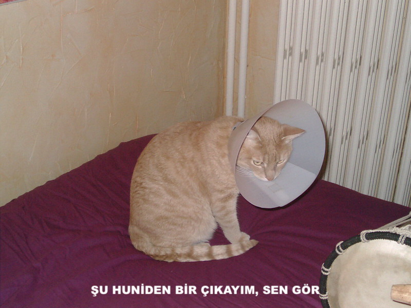

## Ne yapacaksınız

Bu kaynakta bir kedi mem üreticisi yapacaksınız. Kedinizin bir görüntüsünü kullanarak, arkadaşlarınıza göstermek için kendi kedi memizi oluşturabilirsiniz.

## Ne öğreneceksiniz

Bir kedi mem üreticisi oluşturarak şunları öğreneceksiniz:

- JavaScript'te işlevler nasıl yazılır
- Bir kullanıcı tarafından veri girişini değiştirmek için JavaScript nasıl kullanılır
- `oninput` ve `Onchange` kullanıcı eylemlerine yanıt olarak bir web sayfasında canlı gerçekleşmesi için nasıl kullanılır

Bu kaynak, [Raspberry Pi Dijital Yapma Müfredatı](https://www.raspberrypi.org/curriculum/){: target = "_ blank"} 'ın aşağıdaki satırlarındaki öğeleri kapsar:

- [Basit 2D ve 3D varlıklar tasarlama](https://www.raspberrypi.org/curriculum/design/creator){: target = "_ blank"}
- [Bir sorunu çözmek için programlama yapılarını birleştirin](https://www.raspberrypi.org/curriculum/programming/builder){: target = "_ blank"}
