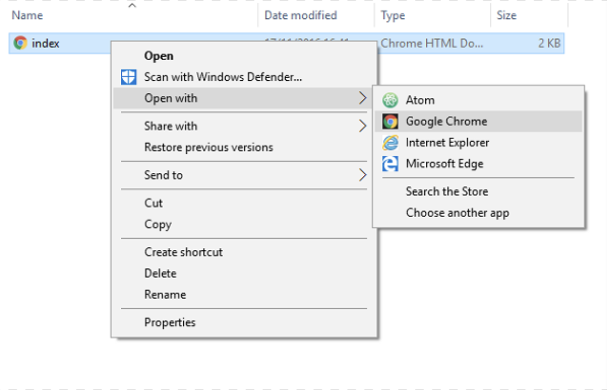

## Web sayfası oluşturun

- Seçtiğiniz metin düzenleyicisinde boş bir dosya açın ve dosyayı kaydedin.

[[[generic-html-create-and-save]]]

- Aşağıdaki HTML kodu size bir sayfanın temel yapısını verir. Kopyalayıp oluşturduğunuz dosyaya yapıştırın, ardından dosyayı kaydedin. Dosyayı düzenleyebilmek için metin düzenleyicisini açık tutun.

  ```html
  <html>
  <head>
    <title>Sayfam</title>
  </head>
  <body>
    Buradaki içeriğim
  </body>
  </html>
  ```

- Web sayfanızı kaydettiğiniz klasöre gidin. Dosyayı internet tarayıcınızla da açın, böylece aynı dosyayı hem metin düzenleyicinizde hem de tarayıcınızda açın.

  Windows'da dosyayı sağ tıklamanız, ``ile aç'ı seçmeniz ve ardından internet tarayıcınızı seçmeniz gerekebilir.

  

  Metin düzenleyicinizdeki kodu her değiştirdiğinizde kaydedin ve güncellenen sayfayı görmek için tarayıcınızdaki yenile düğmesine basın.
