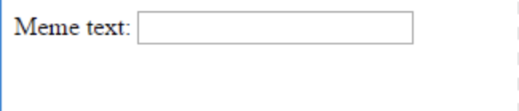

## Resim ve metin alma

İnsanların memi yapmak için kendi resimlerini ve metinlerini kullanabilmelerini istiyoruz, bu yüzden bunları sağlamak için bir yola ihtiyacımız var. Kullanıcılarımızın doldurabileceği bir form ekleyelim.

Bilgisayarınızda bir dosya kullanıyorsanız, bu kodu `<body>` ile `</body>`arasına yerleştirin. CodePen kullanıyorsanız, bu kodu HTML bölümüne yerleştirin.

- Formun başlangıcını gösteren `<form>,` ve formun sonunu gösteren `</form>,` etiketlerini ekleyin.

    ```html
    <form>
    </form>
    ```

- `<form>` içinde, mem yazısı yazabilmek için metin kutusu ekleyin:

  ```html
  <form>
  Meme metni: <input type="text" id="user_text" maxlength="70"><p>
  </form>
  ```

- Kodunuzu kaydedin ve oluşturduğunuz kutuyu görmek için tarayıcınızı yenileyin.

    

- İlk kutunuzun altındaki satırda başka bir giriş kutusu oluşturmak için kod ekleyin. Bu kez giriş kutusu bir metin kutusu değil, mem için görüntü dosyasını seçmek için özel bir kutu olacaktır. Giriş türü `file`ve giriş adı `user_picture`olmalıdır.

--- ipuçları ---

--- ipucu --- İşte zaten yazdığınız kodun yaptığı:

  * `input` kullanıcının bazı veri girişi için bir yol oluşturduğumuzu söylüyor
  * `type = "text"` , verilerin metin olacağını söylüyor
  * `id = "user_text"`, bu kutuya bir değişken adı gibi bir ad veya ID verir
  * `maxlength = "70"` isteğe bağlıdır - 70'ten fazla harf yazmanızı önler, böylece metniniz görüntünün altından fazla yer kaplamaz
  * Giriş kutusundan sonraki `<p>` etiketi bir paragraf ekler (bir sonraki giriş kutusundan biraz boşluk)

Bu bilgileri kullanarak başka bir giriş kutusu oluşturmayı öğrenebilir misiniz?

--- /hint ---

---ipucu---

Kodun aşağıda `***` ile vurgulanan bölümlerini değiştirmeniz gerekecektir:

```html
Bir resim seçin <input type="***" id="***"><p>
```

--- /hint ---

--- ipucu --- İşte eklemeniz gereken kod:

```html
Bir resim seçin <input type="file" id="user_picture"><p>
```
--- /hint ---

--- /hints ---

- Bir dosyaya yazmak ve seçmek için bu kutuları kullanabilirsiniz, ancak henüz hiçbir şey olmayacaktır. **Not**: tüm görüntüler bilgisayarınızda tutulur - bu program internete hiçbir şey yüklemez.
