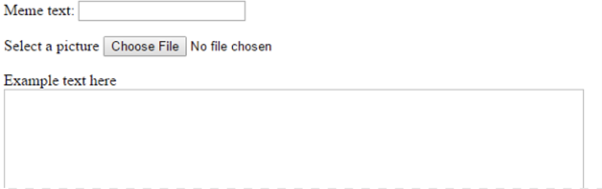
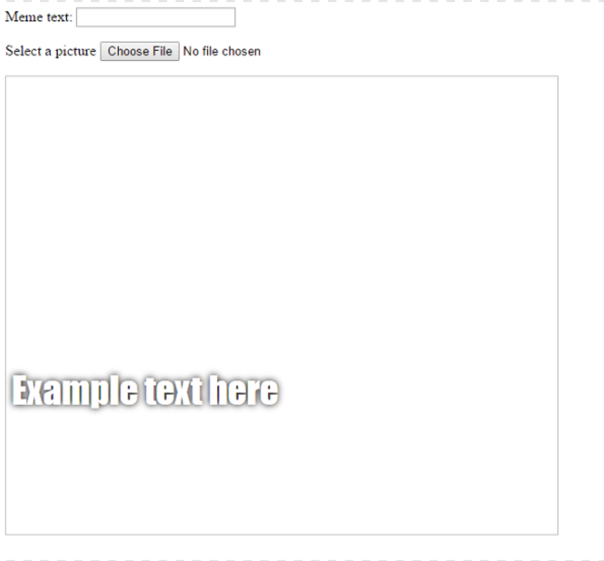

## Mem'i yarat

Mem'in görüntüleneceği bir alan yaratmamız gerekiyor. Bu alan boş olarak başlayacaktır çünkü sayfa ilk yüklendiğinde, kişinin hangi resimi veya hangi metni kullanmak istediğini bilemeyiz.

- `</form>` etiketinin altına yeni bir sıra kod ekleyin:

  ```html
  <div id="meme_text">Örnek metin buraya</div>
  ```

  Bu bir `<div>` öğesi - sonunda bizim mem'imiz için metni tutacak görünmez bir kutu. Bir ` kimliği verdik ` tıpkı giriş kutularına yaptığımız gibi.

- Şimdi bir öncekinin altına `<div>` daha ekleyin:

  ```html
    <div id="meme_picture"></div>
    ```

    Bu `<div>`ın içinde bir imaj gösteren başka bir etiket daha var. ` src = "" ` hangi görüntünün gösterileceğini gösterir. Bu durumda, imajı boş bıraktık, çünkü henüz kullanıcıdan resmimiz almadık.

- Kaydet ve yenile. Resim boş bir kutu olacak ve örnek metin varsayılan yazı tipinde görüntülenecektir, bu çok mem benzeri değildir:

    

- Bilgisayarınızda bir dosya kullanıyorsanız, kodunuzdaki `<head>` bölümünü bulun ve bu kodu `<head>` ve `</head>` arasına ekleyin. (CodePen kullanıyorsanız bu adımı atlayın.)

  ```html
  <style type="text/css">
  </style>
  ```

- Metninize bir mem stili vermek için aşağıdaki kodu `<style>` etiketleri arasına yapıştırın. CodePen kullanıyorsanız, bunu CSS bölümüne yapıştırın.

    ```css
    #meme_text {
        background-color: transparent;
        font-size: 40px;
        font-family: "Impact";
        color: white;
        text-shadow: black 0px 0px 10px;
        width: 600px;
        position: absolute;
        left: 15px;
        top: 400px;
    }
    ```

  `left: 15px` ve `top: 400px` satırları metnin sayfanın solundan ve üstünden ne kadar uzakta olduğunu belirler. İsterseniz metnin meminizde farklı bir yerde görünmesini sağlamak için bu sayıları değiştirebilirsiniz. CSS stilleri hakkında daha fazla bilgi edinmek için [ w3schools CSS reference](http://www.w3schools.com/CSSref/) {:target = "_ blank"} ziyaret edebilirsiniz.

  
