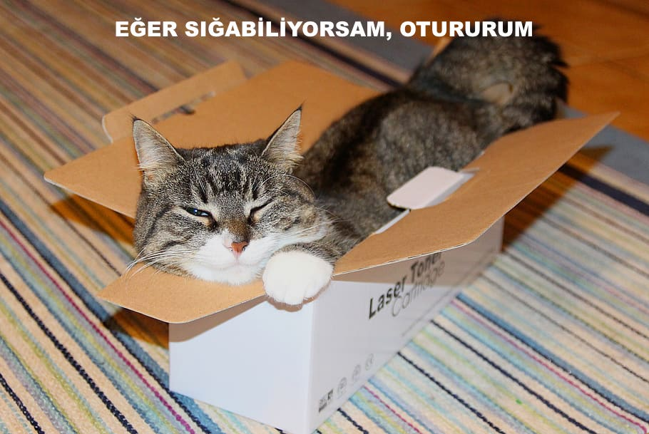

## Resmi görüntüle

Şimdi kullanıcının seçtiği kedi görüntüsünü almak ve mem üzerinde görüntülemek için bazı kodlar yazacağız.

- `update_image` adlı yeni bir JavaScript işlevi tanımlayın. Bu kodu `}` da yer alan yazdığınız bir önceki fonksiyonun dalgalı parantezinden sonra ekleyin.

[[[generic-javascript-create-a-function]]]

- `update_image` fonksiyonunun içine iki yeni değişken oluşturun:

    ```javascript
    var img = document.querySelector ('img');
    ```

    Bu ilk değişken, belgedeki ilk (ve tek!) `` etiketini seçer, böylece sayfaya seçilen görüntünün nerede görüntüleneceğini söyleyebiliriz.

    ```javascript
    var file = document.querySelector('input[type=file]').files[0];
    ```

    Bu ikinci değişken seçilen kedi resim dosyasını gösterir.

- Resim etiketini, kullanıcının yüklediği resmi içerecek şekilde ayarlayın:

    ```javascript
    img.src =  window.URL.createObjectURL(file);
    ```

- Birisi dosya seçtiğinde dosya girişine `update_image()` öğesini çağırmasını söylemek için birkaç kod ekleyin  `onchange` .

--- ipuçları ---

--- ipucu --- Bir önceki adımda, `user_text` giriş kutusuna metin yazıldığında `update_text()` fonksiyonunu kullandığınızı unutmayın. Daha önce öğrendiklerinizi kullanarak kullanıcı `user_file` input box'tan dosya seçtiğinde ` update_image () işlevini nasıl çağırabileceğinizi çözebilir misiniz?
--- /hint ---</p>

<p spaces-before="0">--- ipucu ---
<code>onchange=""` eklemeniz gerekecek ve sonra `***` 'ı istediğiniz komut ile değiştirmeniz gerekecek:
```javascript
Bir resim seçin <input type="file" id="user_picture" onchange="***">
```
--- /hint ---

--- ipucu --- Dosya giriş kutusu için kod satırını bulun ve `onchange="update_image ()" ekleyin, bunun gibi:</p>

<pre><code class="html">Bir resim seçin <input type="file" id="user_picture" onchange="update_image()">
`</pre>

--- /hint ---

--- /hints ---

- Sayfayı kaydedin ve yenileyin. Kodunuz çalışıyorsa, **Select a picture** giriş kutusu seçeneğini kullanarak bir resim seçtiğinizde bu resim aşağıdaki mem kutusunda görünmelidir. Metin kutusuna da bir şey yazarsanız, mem metniniz resmin üstünde görünecektir.


