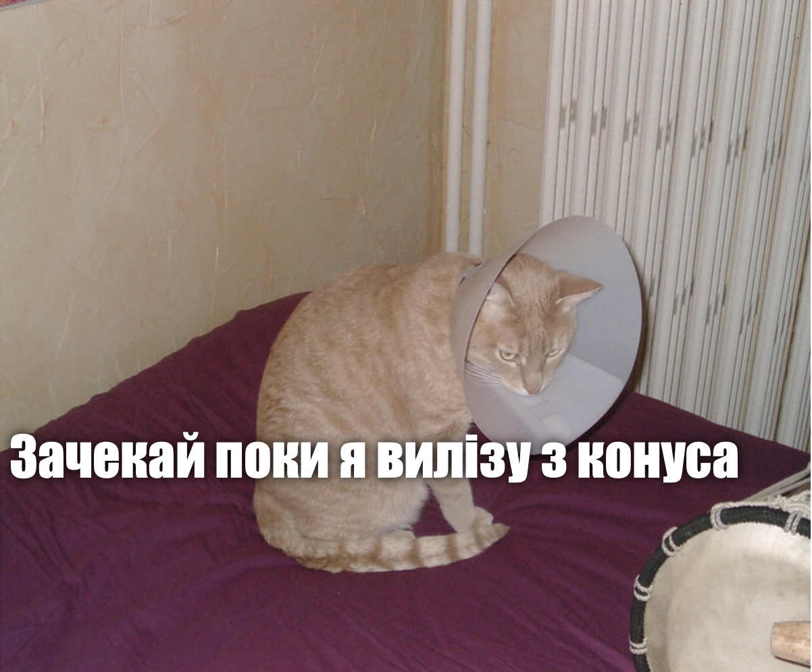

## Що ти зробиш

В цьому проєкті ти зробиш генератор котячих мемів. Використовуючи зображення своєї кішки, ти можеш створити власний котячий мем, щоб показати своїм друзям.

## Що ти вивчиш

Створивши генератор котячих мемів, ти дізнаєшся:

- Як писати функції в JavaScript
- Як використовувати JavaScript для маніпулювання введеними користувачем даними
- Як використовувати `oninput` та `onchange` для того, щоб на вебсторінці щось відбувалося у відповідь на дії користувача

Цей проєкт охоплює елементи з наступних частин [Електронного навчального плану Raspberry Pi](https://www.raspberrypi.org/curriculum/){:target="_blank"}:

- [Розробка простих 2D та 3D засобів](https://www.raspberrypi.org/curriculum/design/creator){:target="_blank"}
- [Комбінування програмних конструкцій для вирішення проблем](https://www.raspberrypi.org/curriculum/programming/builder){:target="_blank"}
