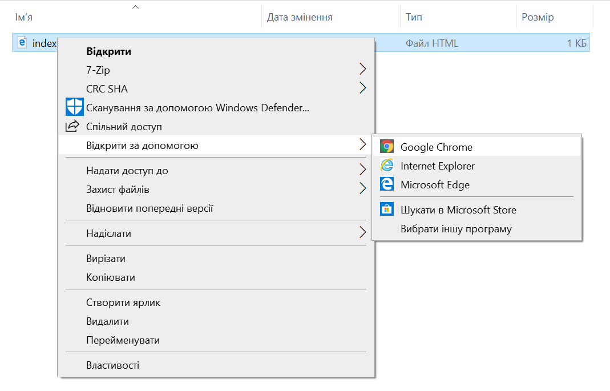

## Створення вебсторінки

- Відкрий порожній файл у вибраному текстовому редакторі та збережи його.

[[[generic-html-create-and-save]]]

- Нижче наведений код HTML задає основну структуру сторінки. Скопіюй та встав його у створений файл, а потім збережи його. Залиш текстовий редактор відкритим, щоб ти міг (могла) редагувати файл.

  ```html
  <html>
  <head>
    <title>Моя сторінка</title>
  </head>
  <body>
    Мій вміст знаходиться тут
  </body>
  </html>
  ```

- Перейди до папки, в якій збережено твою вебсторінку. Open the file with your internet browser as well, so you have the same file open in both your text editor and your browser.

  On Windows, you may need to right-click the file, choose `Open with`, and then select your internet browser.

  

  Whenever you change the code in your text editor, save it and then press the refresh button on your browser to see the updated page.
