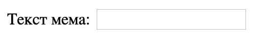

## Отримання малюнка та тексту

Ми хочемо, щоб люди могли використовувати власні картинки та текст, щоб робити меми, тому нам потрібно, щоб вони могли їх надавати. Давай створимо форму, яку зможе заповнювати користувач.

Якщо ти використовуєш файл на своєму комп’ютері, поставте цей код між `<body>` та `</body>`. Якщо ти використовуєш CodePen, додай цей код у розділ HTML.

- Додай теги `<form>,` що вказує на початок форми, і `</form>,` що вказує на її кінець.

    ```html
    <form>
    </form>
    ```

- Усередині свого `<form>`, додай текстове поле так, щоб ти міг ввести текст мема:

  ```html
  <form>
  Текст мема: <input type="text" id="user_text" maxlength="70"><p>
  </form>
  ```

- Збережи свій код і онови веббраузер, щоб побачити створене поле.

    

- Додай код, щоб створити ще одне поле для вводу в наступному рядку після попереднього. Цього разу поле вводу буде не текстовим, а спеціальним для вибору файлу зображення для мема. Тип поля повинен бути `file`, а його ім’я має бути `user_picture`.

--- hints ---

--- hint --- Ось що робить код, який ти вже написав (-ла):

  * `input` означає, що ми створюємо користувачу засіб для надання певних даних
  * `type="text"` означає, що дані будуть текстовими
  * `id="user_text"` дає цьому конкретному полю ім'я або ідентифікатор (ID), на зразок імені змінної
  * `maxlength="70"` is optional - it stops you from typing in more than 70 letters so your text doesn't take up space past the bottom of the image
  * The `<p>` tag after the input box adds a paragraph (a bit of space before the next input box)

Can you work out how to create another input box using this information?

--- /hint ---

--- hint ---

You will need to change the parts of the code highlighted with `***` below:

```html
Select a picture <input type="***" id="***"><p>
```

--- /hint ---

--- hint --- Here is the code you need to add:

```html
Select a picture <input type="file" id="user_picture"><p>
```
--- /hint ---

--- /hints ---

- You can use these boxes to type into and to select a file, but nothing will happen yet. **Note**: all images are kept on your computer - this program does not upload anything to the internet.
