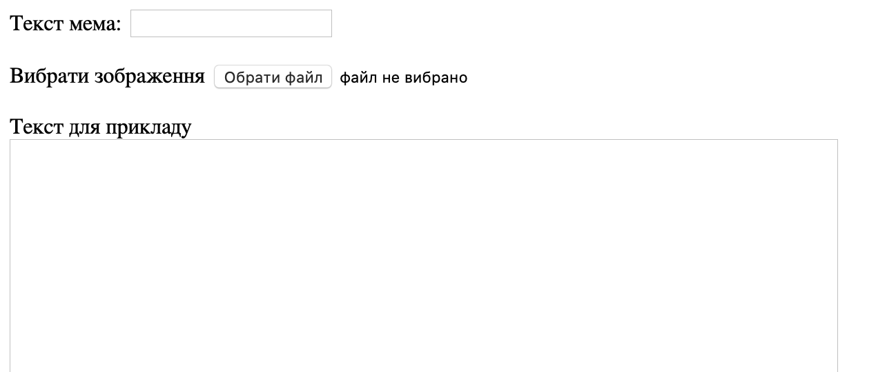
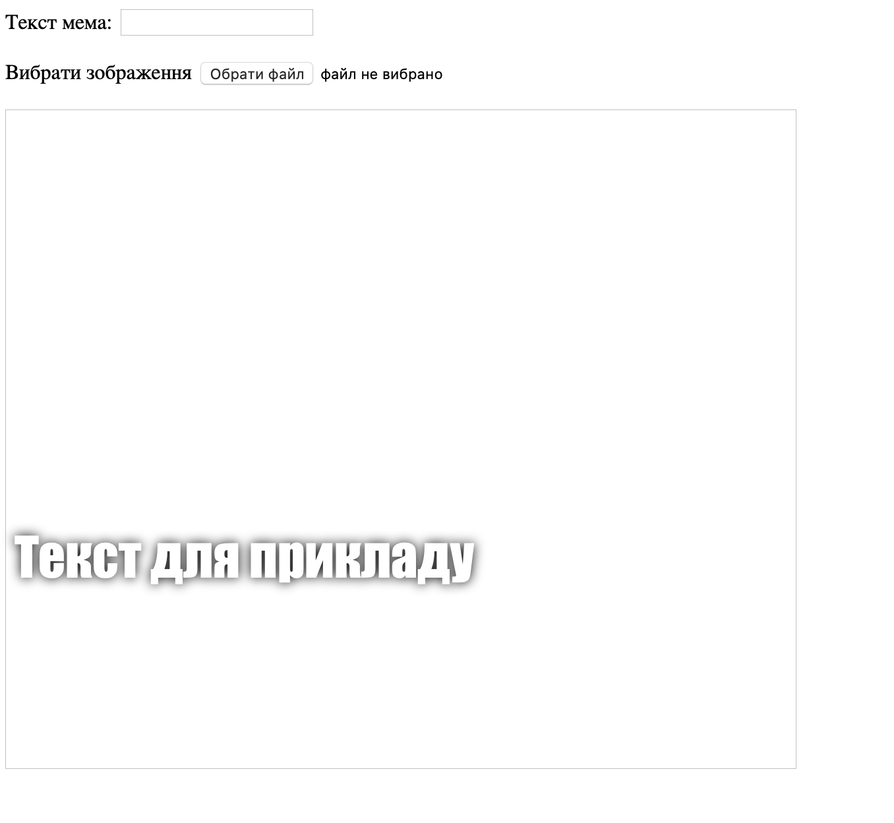

## Створення мема

Нам потрібно створити область, де відображатиметься мем. Спочатку вона буде порожньою, бо коли сторінка вперше завантажується, ми ще не знаємо яке зображення і який текст будуть використовуватися.

- Під тегом `</form>` додай новий рядок коду:

  ```html
  <div id="meme_text">Текст для прикладу</div>
  ```

  Цей елемент `<div>` — невидиме поле, яке потім буде містити текст для мема. Ми дали йому ідентифікатор (`id`) так само, як і для полів для вводу.

- Зараз додай ще один `<div>` під попереднім:

  ```html
    <div id="meme_picture"></div>
    ```

    Всередині цього `<div>` присутній інший тег, який показує зображення. `src=""` вказує на зображення, яке треба показати. В даному випадку ми залишили картинку порожньою, бо користувач ще її не надав.

- Збережи та онови сторінку. Замість зображення буде порожній прямокутник, а текст для прикладу відображатиметься стандартним шрифтом, що не дуже схоже на мем:

    

- Якщо ти використовуєш файл на комп’ютері, знайди секцію `<head>` в своєму коді і додай цей код між `<head>` та `</head>`. (Пропусти цей крок, якщо ти використовуєш CodePen.)

  ```html
  <style type="text/css">
  </style>
  ```

- Встав нижченаведений код між тегами `<style>` для того, щоб надати тексту стиль мема. Якщо ти використовуєш CodePen, то встав його в секцію CSS.

    ```css
    #meme_text {
        background-color: transparent;
        font-size: 40px;
        font-family: "Impact";
        color: white;
        text-shadow: black 0px 0px 10px;
        width: 600px;
        position: absolute;
        left: 15px;
        top: 400px;
    }
    ```

  Рядки `left: 15px` та `top: 400px` визначають як далеко текст розміщено від лівого та верхнього краю сторінки. Якщо хочеш, то можеш змінити ці числа, щоб текст був розміщений в іншому місці твого мема. Якщо ти хочеш більше дізнатися про стилі CSS, відвідай [довідку w3schools CSS](http://www.w3schools.com/CSSref/){:target="_blank"}.

  
