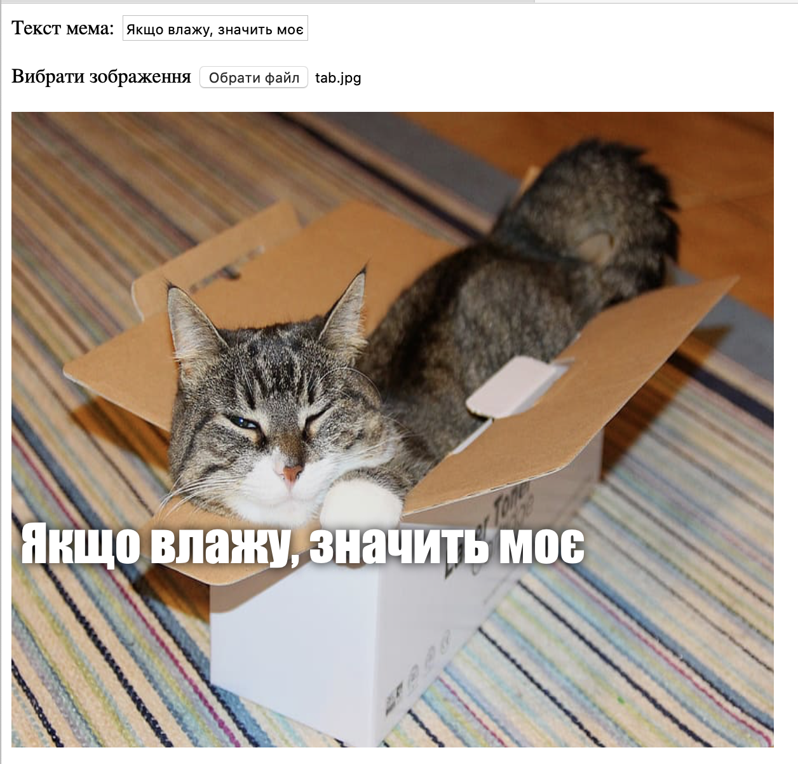

## Показ зображення

Тепер ми напишемо код, щоб взяти зображення кота, яке користувач вибрав, і відобразити його в мемі.

- Створи нову функцію JavaScript з іменем `update_image`. Будь уважним, цей код треба ввести після закриваючої фігурної дужки `}` функції, яку ти вже створив.

[[[generic-javascript-create-a-function]]]

- Всередині функції `update_image` створи дві нові змінні:

    ```javascript
    var img = document.querySelector('img');
    ```

    Перша змінна вибирає перший (і єдиний!) тег `` в документі, щоб ми могли сказати, де відображати вибрану картинку.

    ```javascript
    var file = document.querySelector('input[type=file]').files[0];
    ```

    Друга змінна вказує на вибраний файл із зображеннням кота.

- Зроби, щоб тег зображення містив картинку, яку завантажив користувач:

    ```javascript
    img.src =  window.URL.createObjectURL(file);
    ```

- Тепер додай код, щоб сказати полю вводу файлу викликати функцію `update_image()`, коли хтось вибирає файл (`onchange`).

--- hints ---

--- hint --- Згадай, що на попередньому кроці ти викликав (-ла) функцію `update_text()` коли новий текст вводився в поле `user_text`. Використовуючи ці знання, чи можеш ти придумати, як викликати функцію `update_image()`, коли користувач вибирає файл в полі `user_file`? --- /hint ---

--- hint --- Тобі необхідно додати `onchange="***"` і замінити `***` функцією, яку ти хочеш викликати:
```javascript
Вибрати зображення <input type="file" id="user_picture" onchange="***">
```
--- /hint ---

--- hint --- Знайди рядок коду для поля вводу файлу і додай `onchange="update_image()"` таким чином:
```html
Вибрати зображення <input type="file" id="user_picture" onchange="update_image()">
```

--- /hint ---

--- /hints ---

- Збережи та онови сторінку. Якщо твій код працює правильно, тоді коли ти вибереш зображення за допомогою поля вводу **Вибрати зображення**, воно має з’явитися в полі для мему внизу. Також якщо ти щось введеш в текстове поле, твій текст мема має відобразитися поверх зображення.


