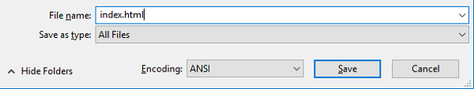

# Cat meme generator

In this resource you will make a cat meme generator. Upload a cute picture of your kitty and add a funny caption for all the world to see!

(Example of cat meme here)

## Create your page
1. Open up a blank file in your chosen text editor.

  If you are using **Notepad**, type in the filename as `index.html` and also change the drop down for Save as type to *All files*

  

  If you are using **TextEdit**...

  If you are using **Nano**...

  If you are using [CodePen](http://codepen.io), simply open up a new pen, then **skip steps 2 and 3**.


2. This HTML code gives you the basic structure of a page. Copy and paste the code into the file you created.

  ```html
  <html>
  <head>
    <title>My page</title>
  </head>
  <body>
    My content here
  </body>
  </html>
  ```
3. Go to the folder where you saved your web page. Open the file with your internet browser, so now you will have the same file open in both your text editor and your internet browser at the same time.

  On **Windows**, you may need to right click the file, choose to `Open with` and then select your internet browser

  

  When you change the code in your text editor, press the refresh button on your internet browser and you should see the page update.

## Add the form
We want people to be able to use their own picture and text to make the meme, so we need a way for them to provide these.

1. Let's add a form that our user can fill in. We are going to add the tag `<form>` which means the start of the form, and `</form>` which means the end of the form.

  If you are using CodePen this code goes in the HTML section, and if you are using a file on your computer this code goes between `<body>` and `</body>`.

  ```html
  <form>
  </form>
  ```

2. Now, inside your `<form>` you need to add a text box so that you can type in your meme text.

  ```html
  Meme text: <input type="text" id="meme_text" maxlength="70"><p>
  ```
  Save your code and refresh your internet browser to see the box you created. Here's what this code does:
  * `input` says we are creating a way for the user to provide some data
  * `type="text"` says that the data will be text
  * `id="meme_text"` gives this particular box a name or id (a bit like a variable name)
  * `maxlength="70"` this stops you from typing in more than 70 letters so the text doesn't go off the bottom of the image - but this is optional
  * There is a `<p>` tag after the input box to add a paragraph (a bit of space before the next input box)

3. Now let's add another input, this time so that you can select the image file for your meme

  ```html
  Select a picture <input type="file" id="picture"><p>
  ```
  Using what you know from step 2, you should be able to work out what `type="file"` and `id="picture"` mean too.

## Update the text

## Display the image


## The finished code
The [finished code](http://codepen.io/rpflaura/pen/NbbveK) is on CodePen for you to play with

## What next?
* You could add some different results pages to your quiz and change your score calculation to reflect this
