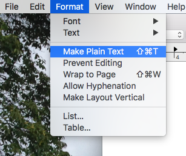
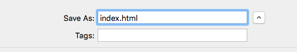
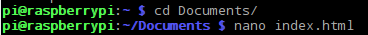
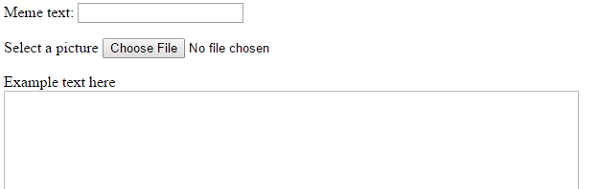
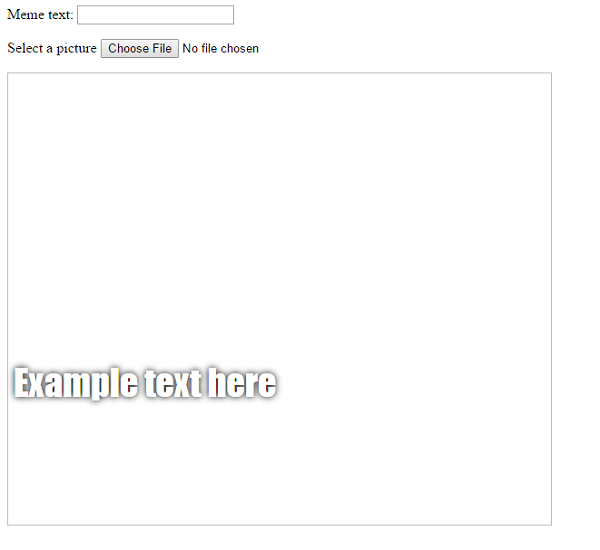

# Cat meme generator

In this resource you will make a cat meme generator. Upload a cute picture of your kitty, and add a funny caption for all the world to see!


## Create a web page

1. Open up a blank file in your chosen text editor and save the file as follows:

-  If you're using **Notepad** on Windows, type in the filename as `index.html` and also change the drop-down for the 'Save as' type to *All files*.

  

  If you're using **TextEdit** on Mac OS, open a new file, then select `Format` > `Make Plain Text`.

  

  Make sure you save the file as `index.html`. 

  

  If you're using **Nano** on a Raspberry Pi, open a terminal window, move to the directory you wish to create your web page in, and type `nano index.html`.

  

  If you're using [CodePen](http://codepen.io), simply open up a new pen, then **skip steps 2 and 3**.


1. This HTML code gives you the basic structure of a page. Copy and paste the code into the file you created, then save the file.

  ```html
  <html>
  <head>
    <title>My page</title>
  </head>
  <body>
    My content here
  </body>
  </html>
  ```
  
1. Go to the folder where you saved your web page. Open the file with your internet browser, so now you'll have the same file open in both your text editor and your browser at the same time.

  On Windows, you may need to right-click the file, choose `Open with`, and then select your internet browser.

  

  Whenever you change the code in your text editor, save it and then press the refresh button on your browser to see the page update.

## Add the form

We want people to be able to use their own picture and text to make the meme, so we need a way for them to provide these.

1. Let's add a form that our user can fill in. We're going to add the tag `<form>` which means the start of the form, and `</form>` which means the end of the form.

  If you're using a file on your computer, put this code between `<body>` and `</body>`. If you're using CodePen, put this code in the HTML section.

  ```html
  <form>
  </form>
  ```

1. Now, inside your `<form>` you need to add a text box so that you can type in your meme text:

  ```html
  Meme text: <input type="text" id="user_text" maxlength="70"><p>
  ```
  
  Save your code and refresh your browser to see the box you created. Here's what this code does:
  
  * `input` says we are creating a way for the user to provide some data.
  * `type="text"` says that the data will be text.
  * `id="user_text"` gives this particular box a name or ID, a bit like a variable name.
  * `maxlength="70"` stops you from typing in more than 70 letters so the text doesn't go off the bottom of the image; this is optional.
  * There is a `<p>` tag after the input box to add a paragraph (a bit of space before the next input box).

1. Now let's add another input, this time so that you can select the image file for your meme:

  ```html
  Select a picture <input type="file" id="user_picture"><p>
  ```
  
  Using what you know from step 2, you should be able to work out what `type="file"` and `id="user_picture"` mean.

You can use these boxes to type in and to select a file, but nothing will happen. You now need to code the instructions to build the meme.

## Build the meme

We need to create an area where the meme will display. This area will start off blank because when the page first loads, we won't know which picture or what text the person wants to use.

1. Underneath the `</form>` tag, add in a new line of code:

  ```html
  <div id="meme_text">Example text here</div>
  ```
  
  This is a `<div>` element; it's an invisible box which will eventually hold the text for our meme. We have given it an `id` just like we did for the input boxes.

1. Now add another `<div>` below the last:

  ```html
    <div id="meme_picture"></div>
    ```
    
    In this `<div>` there's also another tag which displays an image; `src=""` is which image to display. In this case we've left the image blank, because we don't yet have the picture from the user. 

1. The text will display in the default font, which isn't very meme-like: 

    

    If you're using a file on your computer, find the `<head>` section in your code and add this code between `<head>` and `</head>`. Skip straight to step 4 if you're using CodePen:

  ```html
  <style type="text/css">
  </style>
  ```
  
1. Between the `<style>` tags, paste in this code to give it a meme text style. If you're using CodePen, paste this code into the CSS section:

  ```css
  	#meme_text {
		background-color: transparent;
		font-size: 40px;
		font-family: "Impact";
		color: white;
		text-shadow: black 0px 0px 10px;
		width: 600px;
		position: absolute;
		left: 15px;
		top: 400px;
  	}
  ```
  
  The `left: 15px` and `top: 400px` lines determine how far the text is from the left and the top of the page. You can alter these numbers to make the text appear in a different place on your meme if you like. If you would like to know more about CSS styles, visit the [w3schools CSS reference](http://www.w3schools.com/CSSref/).

  

## Display the text

So far, all of the code you have written is HTML code, which tells the page what it should *look like*. Now we're going to add some JavaScript code to tell the page *what to do*.

When someone types text into the text box, we want their text to display inside the `<div id="meme_text">` that we just created.

1. If you're using CodePen, skip to step 2 and write the code in the JavaScript section. If you're using a page on your computer, add some HTML tags underneath your `<div>` tags to create a JavaScript section:

  ```html
  <script type="text/javascript">
  </script>
  ```

1. Firstly, we'll write a JavaScript function to tell the web page to take any text that's in the input box and display it in the "meme_text" `<div>`. Between the two `<script>` tags you just created, add this code. It looks pretty different to the code we've written so far, because it's JavaScript, which is a different language.

  ```JavaScript
  function update_text(){

  }
  ```
  
  You've just created a JavaScript function called `update_text()`. There are no instructions in the brackets at the moment, so the function won't do anything yet!

1. Between the curly brackets `{ }`, add this code:

  ```JavaScript
  var user_text = document.getElementById("user_text");
  ```
  
  Let's break this code down so that you understand what it does:
  
  * `var user_text` creates a new variable with the name "user_text".
  * `=` sets the value of this variable to...
  * `document.getElementById("user_text")`, which looks through the web page and points to the element with the ID `user_text` (the input text box we created earlier).

1. Now it's your turn to write a line of code. Create a variable called `meme_text` which points to the element with the ID `meme_text` (the "meme_text" `<div>` we created earlier).

1. We want to set the "meme_text" `<div>` to contain the same text the user has typed into the `meme_text` textbox. Add this line of code to your JavaScript function:

  ``` JavaScript
  meme_text.innerHTML = user_text.value;
  ```

  * `.innerHTML` means what is displayed inside the `<div>`.
  * `.value` means what is typed into the text box.

1. Lastly, we need to tell the box that when someone types into it, it should call the function we just wrote so that the text in the meme will update. Find the code for your text box and add in an **attribute** for `oninput="update_text()"` so that it now looks like this:

  ```html
  Meme text: <input type="text" id="user_text" maxlength="70" oninput="update_text()"><p>
  ```

  Save and refresh your page, then try typing into your text box and see what happens!

## Display the image

We will now get the image that the user selected and put it inside the `<div>` we created.

1. Make a new JavaScript function. Be careful to type this code after the closing curly bracket `}` of your last function.

    ```javascript
    function update_image(){

    }
    ```

1. Inside your new function, create two new variables:

    ```javascript
    var img = document.querySelector('img');
    ```
    
    This variable selects the first (and only!) `` tag in the document, so that we can tell the page where to display the image the user selected.

    ```javascript
    var file = document.querySelector('input[type=file]').files[0];
    ```
    
    This variable points to the picture file that the user selected.

1. Now set the image tag to contain the picture that the user uploaded:

    ```javascript
    img.src =  window.URL.createObjectURL(file);
    ```

1. Finally, tell the file input to call the `update_image()` function when someone selects a file. Find the line of code for the file input box and add `onchange=update_image()`:

    ```html
    Select a picture <input type="file" id="user_picture" onchange="update_image()">
    ```

    


## The finished code

Now generate yourself an awesome meme, perhaps starring your own cat. The [finished code](http://codepen.io/rpflaura/pen/NbbveK) is also on CodePen for you to play with. Show off your meme to your friends!

It's pretty tricky to make the page automatically generate the meme as a picture you can save. However, if you want to keep your meme you could use the Print Screen button (Windows) / `Cmd + Shift + 4` (Mac OS) / `scrot` command in the terminal (Linux on Raspberry Pi) to take a screenshot of the page, and then crop it down using your favourite image editor.

## What next?

* You could add some other CSS styles - why not change the style of the text, or give the image a border?
* Add another input text box and position this text at the top of the meme, so you can have text on both the top and bottom.
