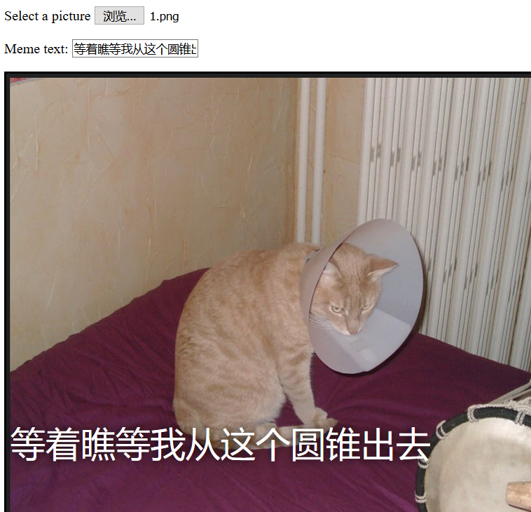

## 你将制作：

在此资源中，您将制作猫咪表情包生成器。 使用猫的图片，您可以创建自己的猫表情包向朋友展示。

## 你将学到什么

通过创建猫表情包生成器，您将学到：

- 如何用JavaScript编写函数
- 如何使用 JavaScript 来处理用户的数据输入
- 如何使用 `oninput` 和 `onchange` 来响应用户操作

该资源涵盖了 [树莓派数字创作课程](https://www.raspberrypi.org/curriculum/){:target="_blank"}中的以下方面：

- [设计基本 2D 和 3D 数字资产](https://www.raspberrypi.org/curriculum/design/creator){:target="_blank"}
- [利用编程来解决问题](https://www.raspberrypi.org/curriculum/programming/builder){:target="_blank"}
