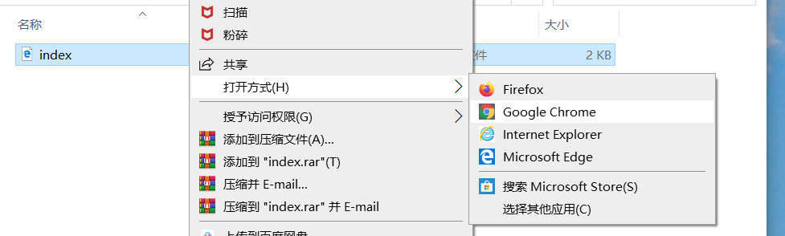

## 创建一个网页

- 在您选择的文本编辑器中打开一个空白文件，然后保存该文件。

[[[generic-html-create-and-save]]]

- 下面的 HTML 代码为您提供了页面的基本结构。 将其复制并粘贴到您创建的文件中，然后保存文件。 保持文本编辑器处于打开状态，以便您可以编辑文件。

  ```html
  <html>
  <head>
    <title>我的页面</title>
  </head>
  <body>
    我的内容在这里
  </body>
  </html>
  ```

- 转到保存网页的文件夹。 使用浏览器打开该文件，使得该文件在文本编辑器和浏览器中都保持打开状态。

  在 Windows 上，您可能需要右键单击该文件，选择 `打开方式`，然后选择您的浏览器。

  

  每当您在文本编辑器中更改代码时，请保存该代码，然后按浏览器上的刷新按钮以查看更新的页面。
