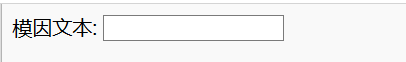

## 获取图片和文字

我们希望人们能够使用自己的图片和文字来制作模因，因此我们来为他们制作这种工具。 让我们添加一个用户可以填写的表单。

如果您在使用本地文本文件，请将此代码置于 `<body>` 和 `</body>`。 如果您使用的是 CodePen，请将此代码放入 HTML 部分。

- 添加标记 `<form>，` 指示表单的开始，`</form>，` 指示表单的结尾。

    ```html
    <form>
    </form>
    ```

- 在您的 `<form>` 标签内，添加一个文本框，以便您可以输入模因文本：

  ```html
  <form>
  Meme文字： <input type="text" id="user_text" maxlength="70"><p>
  </form>
  ```

- 保存您的代码并刷新浏览器以查看创建的输入框。

    

- 在第一个输入框下面的添加代码以创建另一个输入框。 This time the input box will not be a text box, but a special box to select the image file for the meme. The input type should be `file`, and the name of the input should be `user_picture`.

--- hints ---

--- hint --- Here's what the code you already wrote does:

  * `input` says we are creating a way for the user to provide some data
  * `type="text"` says that the data will be text
  * `id="user_text"` gives this particular box a name or ID, a bit like a variable name
  * `maxlength="70"` is optional - it stops you from typing in more than 70 letters so your text doesn't take up space past the bottom of the image
  * The `<p>` tag after the input box adds a paragraph (a bit of space before the next input box)

Can you work out how to create another input box using this information?

--- /hint ---

--- hint ---

You will need to change the parts of the code highlighted with `***` below:

```html
Select a picture <input type="***" id="***"><p>
```

--- /hint ---

--- hint --- Here is the code you need to add:

```html
Select a picture <input type="file" id="user_picture"><p>
```
--- /hint ---

--- /hints ---

- You can use these boxes to type into and to select a file, but nothing will happen yet. **Note**: all images are kept on your computer - this program does not upload anything to the internet.
