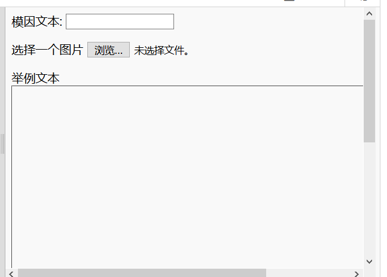
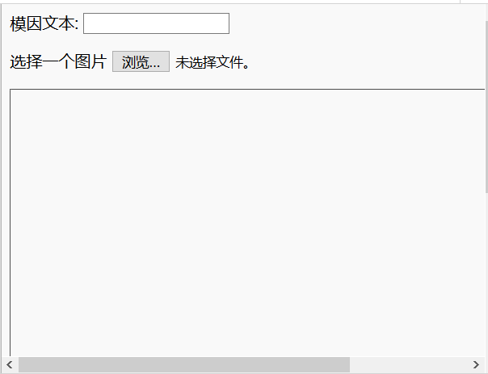

## 建立模因

我们需要创建一个显示模因的区域。 该区域将从空白开始，因为首次加载页面时我们不知道这个人要使用的图片或文字。

- 在`</form>`标签下，添加新的代码行：

  ```html
  <div id="meme_text">这是示例文本</div>
  ```

  这是一个 `<div>` 元素-它一个用户不可见的输入控件，用来保存的模因文字。 我们给了它一个 `id`，就像我们对输入框所做的一样。

- 现在在前一个控件下面添加另一个 `<div>`：

  ```html
    <div id="meme_picture"></div>
    ```

    在这个 `<div>` 中，还有另一个用于显示图像的标签。 `src =""` 指示要显示的图像。 在这种情况下，我们将图像留空了，因为我们还没有用户的图片。

- 保存并刷新。 图片将是一个空白框，示例文本将以默认字体显示，这不是很像模因：

    

- 如果你正在使用本地的文件，请在代码中找到 `<head>` 部分，并将此代码添加到 `<head>`和`</head>` 之间。 (如果你使用的是CodePen，请跳过此步骤)

  ```html
  <style type="text/css">
  </style>
  ```

- 将以下代码粘贴在 `<style>` 标记之间，以使你的文本具有模因样式。 如果你使用的是 CodePen，请将其粘贴到 CSS 部分。

    ```css
    #meme_text {
background-color: transparent;
font-size: 40px;
font-family: "Impact";
color: white;
text-shadow: black 0px 0px 10px;
width: 600px;
position: absolute;
left: 15px;
top: 400px;
}
    ```

  `left: 15px` 和 `top: 400px` 行决定文本距页面左侧和顶部的距离。 如果你喜欢，你可以更改这些数字，以使文本显示在模因上的其他位置。 如果你想进一步了解 CSS 样式，请访问 [w3schools CSS 参考](http://www.w3schools.com/CSSref/){:target="_blank"}。

  
