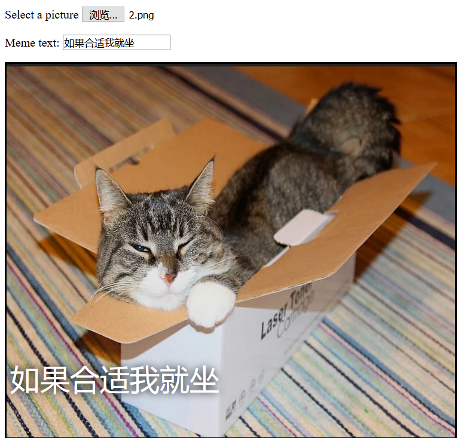

## 显示图像

现在，我们将编写一些代码来回去用户选择的猫图像并将其显示在模因上。

- 定义一个新的 JavaScript 函数，名为 `update_image` 。 请注意在你创建的上一个函数的大括号 `}` 之后输入此代码。

[[[generic-javascript-create-a-function]]]

- 在 `update_image` 函数内，创建两个新变量：

    ```javascript
    var img = document.querySelector('img');
    ```

    这个变量选择文档中的第一个(也是唯一的) `` 标签，这样我们就可以告诉页面在何处显示所选图像。

    ```javascript
    var file = document.querySelector('input[type=file]').files[0];
    ```

    第二个变量指向所选的猫图片文件。

- Set the image tag to contain the picture that the user has uploaded:

    ```javascript
    img.src =  window.URL.createObjectURL(file);
    ```

- Now add some code to tell the file input to call the `update_image()` function `onchange` when someone selects a file.

--- hints ---

--- hint --- Remember that, in the previous step, you called the function `update_text()` when new text was written into the `user_text` input box. Using what you learned then, can you work out how to call the function `update_image()` when the user selects a file in the `user_file` input box? --- /hint ---

--- hint --- You will need to add `onchange=""` and then replace the `***` with the function you would like to call:
```javascript
Select a picture <input type="file" id="user_picture" onchange="***">
```
--- /hint ---

--- hint --- Find the line of code for the file input box and add `onchange="update_image()"` like this:
```html
Select a picture <input type="file" id="user_picture" onchange="update_image()">
```

--- /hint ---

--- /hints ---

- Save and refresh the page. If your code is working, when you select a picture using the **Select a picture** input box, that picture should appear in the meme box below. If you also type something into the text box, your meme text should appear on top of the picture.


