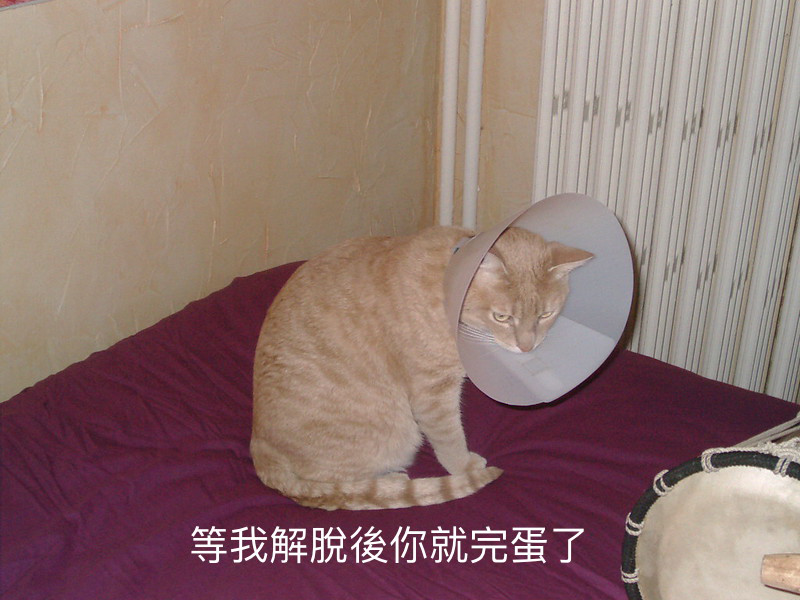

## 你將會製作出

在此資源中，您將製作出一個貓咪迷因製造機。 使用你的貓咪圖片，你就可以製作出自己的貓咪迷因並向你的朋友炫耀。

## 你將會學到

透過製作出貓迷迷因製造機，你將學到：

- 如何使用JavaScript編寫函數
- 如何使用JavaScript來操作使用者輸入的資料
- 如何使用 `oninput` 和 `onchange` 來讓使用者的操作真實的反映在一個網頁中

此資源涵蓋了以下 [Raspberry Pi Digital Making Curriculum](https://www.raspberrypi.org/curriculum/){:target="_blank"} 的元素：

- [設計基本的2D和3D物件](https://www.raspberrypi.org/curriculum/design/creator){：target =“ _ blank”}
- [使用程式結構來解決問題](https://www.raspberrypi.org/curriculum/programming/builder){：target =“ _ blank”}
