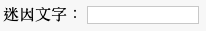

## 取得圖片和文字

我們希望所有人能夠使用自己的圖片和文字來製作迷因，因此我們需要為他們提供一個方式來達成。 讓我們新增一個我們的使用者可以填寫的表格。

如果你想使用你電腦中的檔案，請將此程式碼置於 `<body>` 和 `</body>` 標籤內。 如果你使用的是CodePen，請將此程式碼放入HTML區塊中。

- 新增 `<form>,` 標籤，代表表格的開頭，和 `</form>,` 標籤，代表表格的結尾。

    ```html
    <form>
    </form>
    ```

- 在你的 `<form>` 標籤內，新增一個文字框，以便你可以輸入迷因文字：

  ```html
  <form>
  Meme文字： <input type="text" id="user_text" maxlength="70"><p>
  </form>
  ```

- 儲存你的程式碼並重新整理你的瀏覽器頁面來查看新建立的的文字框。

    

- 在你的第一個文字框的程式碼下面新增程式碼來建立另一個輸入框。 這次，輸入框將不是文字框，而是一個用於選擇迷因圖片檔案的特殊框。 輸入類型應為 `file`，且輸入框的名稱應為 `user_picture`。

--- 提示 ---

---提示--- 這是你已經編寫好的程式碼的功能：

  * `輸入` 表示我們正在為使用者建立一種提供資料的方式
  * `type =“ text”` 表示這些資料將為文字
  * `id =“ user_text”` 為這個特定的框指定名稱或ID，有點像變數名稱
  * `maxlength =“ 70”` 是可自由選擇的 - 這將使你無法輸入70個以上的字母，如此你的文字不會佔用超過圖片底部的空間
  * 輸入框後面的 `<p>` 標籤，增加一個段落（下一個輸入框前的一些空間）

你是否可以想出如何透過這些資訊來建立另一個輸入框的方法呢？

--- /hint ---

--- 提示 ---

你將需要更改下面用 `***` 突出顯示的程式碼：

```html
選擇一張圖片 <input type="***" id="***"><p>
```

--- /hint ---

---提示--- 這是你需要新增的程式碼：

```html
選擇一張圖片 <input type="file" id="user_picture"><p>
```
--- /hint ---

--- /hints ---

- 你可以使用這些框來輸入和選擇一個檔案，但是什麼也不會發生。 **Note**：所有圖片都儲存在你的電腦中 - 這個程式不會將任何內容上傳到Internet。
