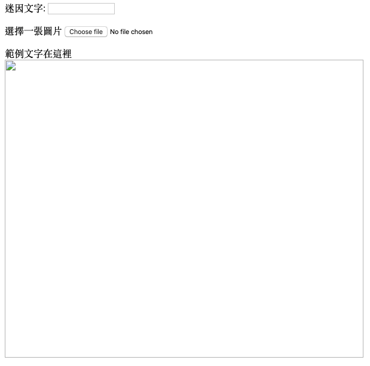
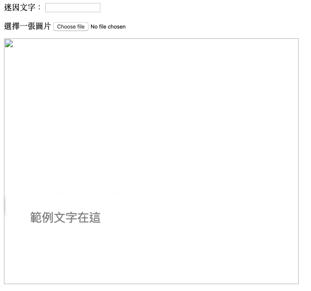

## 建立一個迷因

我們需要創建一個區域來顯示迷因。 該區域將從空白開始，因為首次載入頁面時，我們無法知道使用者想要使用的圖片或文字。

- 在`</form>`標籤下方，加入新的一行程式碼：

  ```html
  <div id="meme_text">例如在這裡添加文字！</div>
  ```

  這是一個`<div>`元素 - 一個隱形的方格，最終將我們的迷因文字內容放在裡面。 我們給了它一個`id`，就像我們對輸入框所做的一樣。

- 現在，請在前一個底下新增一個`<div>`標籤：

  ```html
    <div id="meme_picture"></div>
    ```

    在這個`<div>`標籤內，還有另一個用於顯示圖片的標籤。 `src=""` 指向想要顯示的圖片。 在目前情況下，我們將圖片部分留空白，因為我們還沒有使用者的貓咪照片。

- 儲存並重新整理 該圖片將是一個空白框，且範例文字將以預設的字體顯示，但這字體不太像迷因會使用的：

    

- 如果你想要使用電腦硬碟中的檔案，請在你的程式碼中尋找`<head>`區塊，並在區塊中的`<head>` 和 `</head>`之間加入這段程式碼。 （如果您使用的是CodePen，請跳過此步驟。）

  ```html
  <style type="text/css">
  </style>
  ```

- 請在那些`<style>`標籤內貼上此段程式碼來幫你的文字加上迷因字體樣式。 如果您使用的是CodePen，請將此複製並貼上到CSS區塊。

    ```css
    #meme_text {
        background-color: transparent;
        font-size: 40px;
        font-family: "Impact";
        color: white;
        text-shadow: black 0px 0px 10px;
        width: 600px;
        position: absolute;
        left: 15px;
        top: 400px;
    }
    ```

  `left: 15px` 和 `top: 400px` 程式碼決定了這段文字距離此頁面左邊邊界和上端邊界的距離。 你可以根據你的需求更改數值，來讓你的迷因文字呈現在此頁面上的不同地方。 如果您想進一步了解更多CSS樣式，請參閱[w3schools CSS reference](http://www.w3schools.com/CSSref/){:target="_blank"}。

  
