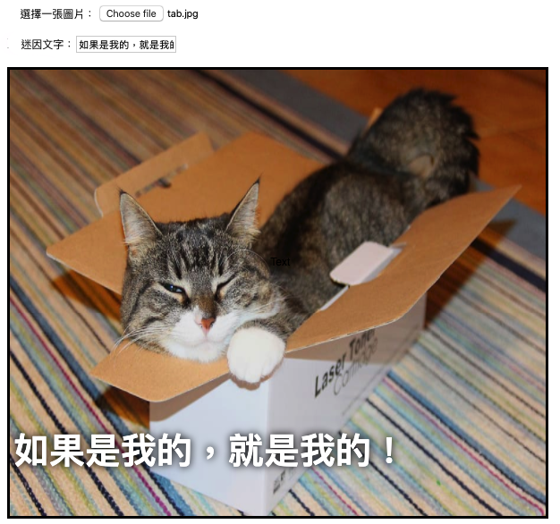

## 顯示圖片

我們現在將要編寫一些程式碼來擷取使用者選擇的貓咪圖片，並顯示在迷因上。

- 請定義一個新的JavaScript函數，叫做 `update_image`。 請注意在你剛才建立的函數的結尾大括號之後，`}` ，加入此行程式碼。

[[[generic-javascript-create-a-function]]]

- 在 `update_image` 函數裡面，新增兩個新的變數：

    ```javascript
    var img = document.querySelector('img');
    ```

    第一個變數選擇了文件中第一個（且是唯一的）`` 標籤，如此我們可以告訴此頁面將所選擇的圖片顯示在哪邊。

    ```javascript
    var file = document.querySelector('input[type=file]').files[0];
    ```

    第二個變數指向使用者所選擇的貓咪照片檔案。

- 設定此圖片標籤來包含使用者上傳的圖片：

    ```javascript
    img.src =  window.URL.createObjectURL(file);
    ```

- 現在，加上一些程式碼來告訴檔案的輸入端，當有人選擇一個檔案的時候，去呼叫 `update_image()` 函數的功能，`onchange`。

--- hints ---

--- hint --- 請記住，在上一步中，你在有新文字被寫入 `user_text` 輸入框時，呼叫了函數 `update_text()`。 就你目前所學習到的知識，請問你是否可以寫出程式碼，當使用者選擇在 `user_file` 輸入框選擇一個檔案時，去呼叫使用函式 `update_image()` ？
--- /hint ---


--- hint --- 你將需要新增 <`onchange=""` 然後以你想要呼叫使用的函式來替換 `***` ：
```javascript
選擇一張圖片 <input type="file" id="user_picture" onchange="***">
```
--- /hint ---

--- hint --- 找到文字輸入框的那行程式碼，並新增 `onchange="update_image()"` ，像這樣：
```html
選擇一張圖片 <input type="file" id="user_picture" onchange="update_image()">
```

--- /hint ---

--- /hints ---

- 儲存並刷新此頁面。 如果你的程式碼成功執行了，那麼在當你使用 **Select a picture** 輸入框來選擇一張圖片時，該圖片應該顯示在下面的迷因框中。 如果你同時也輸入一些字在文字框中，那麼您的迷因文字應該出現在圖片的上方。


